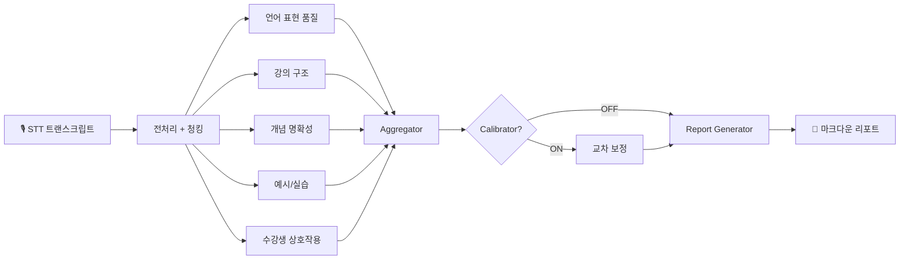

# AI 강의 분석 리포트

> 강의 녹취록을 넣으면, AI가 18개 항목으로 채점하고 리포트를 만들어요.

`React 19` `LangGraph` `FastAPI` `GPT-4o` `Claude` `Supabase`

<br/>

## 👥 팀

> 멋쟁이사자처럼 AXP 인턴 1-2조 · 4주 프로젝트

<table>
  <tr>
    <td align="center" width="250">
      <b>손영진</b><br/>
      <sub>Project Lead · Frontend · 기획</sub><br/><br/>
      프로젝트 기획 및 전체 설계<br/>
      프론트엔드 대시보드 (React 19)<br/>
      UI/UX 디자인 · 발표 영상 제작<br/>
      AI 평가 하네스 설계
    </td>
    <td align="center" width="250">
      <b>안례진</b><br/>
      <sub>Backend · 기술 기획</sub><br/><br/>
      시스템 아키텍처 설계<br/>
      LangGraph 파이프라인 구현<br/>
      FastAPI 서버 · 실험 설계<br/>
      AI 평가 하네스 품질 관리
    </td>
    <td align="center" width="250">
      <b>정지훈</b><br/>
      <sub>AI Engineer · Backend</sub><br/><br/>
      LLM 평가 파이프라인 최적화<br/>
      AI 하네스 품질 평가 및 정교화<br/>
      신뢰도 메트릭 구현 (ICC, Kappa, Alpha)<br/>
      백엔드 성능 개선
    </td>
    <td align="center" width="250">
      <b>이은비</b><br/>
      <sub>Data Analysis · QA</sub><br/><br/>
      강의 데이터 전처리 및 EDA<br/>
      평가 결과 데이터 검증<br/>
      실험 데이터 정리 및 시각화<br/>
      품질 보증 (QA)
    </td>
  </tr>
</table>

<br/>

## 목차

- [이 프로젝트가 풀려는 문제](#-이-프로젝트가-풀려는-문제)
- [시스템이 동작하는 방식](#%EF%B8%8F-시스템이-동작하는-방식)
- [실험 프레임워크](#-실험-프레임워크--이-점수를-믿어도-될까)
- [주요 기능](#-주요-기능)
- [기술 스택](#%EF%B8%8F-기술-스택)
- [코드가 실제로 하는 일](#-코드가-실제로-하는-일)
- [프로젝트 구조](#-프로젝트-구조)
- [시작하기](#-시작하기)
- [대시보드 페이지](#%EF%B8%8F-대시보드-페이지)
- [문서](#-문서)
- [뇌 반응 시뮬레이션 (TRIBE v2)](#-뇌-반응-시뮬레이션-tribe-v2)
- [고도화 로드맵](#%EF%B8%8F-고도화-로드맵)

---

## 🎯 이 프로젝트가 풀려는 문제

"오늘 강의 어땠나요?"

이 질문에 보통은 수강생 설문으로 답해요. 그런데 설문은 주관적이고, 매번 같은 기준으로 측정하기 어렵고, 강사에게 구체적으로 뭘 바꾸라고 말해주지 못해요.

우리 시스템은 다르게 접근해요. **강의 녹음을 텍스트로 바꾼 다음, AI가 직접 읽고 18개 항목으로 채점해요.** "비유를 몇 번 썼는지", "이해 확인 질문을 얼마나 자주 했는지", "학습 목표를 처음에 안내했는지" — 사람이 강의를 들으면서 체크하는 걸 LLM이 대신 해주는 거예요.

백엔드 부트캠프 21기(Java, KDT) 15개 강의를 대상으로 3개 AI 모델(GPT-4o mini, Claude Opus, Claude Sonnet)이 교차 평가한 결과를 대시보드에서 바로 확인할 수 있어요.

---

## ⚙️ 시스템이 동작하는 방식

### 한 문장으로 요약하면

> 강의 녹취록이 들어오면 → 30분 단위로 쪼개고 → 5개 카테고리 평가자가 동시에 읽고 점수를 매기고 → 가중 평균을 내고 → 리포트를 만들어요.



<details>
<summary><b>Step 1. 전처리 — 스크립트를 시간 단위로 잘라요</b></summary>

강의 STT 트랜스크립트는 보통 3~4시간, 수천 줄이에요. 이걸 통째로 LLM에 넣을 수 없으니까 **시간 윈도우 기반으로 청킹**해요.

```
원본 트랜스크립트 (3시간, 2000줄)
    ↓ chunk_by_time_window(window=30분, overlap=5분)
    ↓
[청크 0] 00:00 ~ 00:30  (도입부)
[청크 1] 00:25 ~ 00:55  (← 5분 겹침)
[청크 2] 00:50 ~ 01:20
    ...
[청크 N] 마지막 구간
```

왜 토큰 수가 아니라 시간으로 자를까요? 강의에서는 "도입부에서 학습 목표를 안내했는지", "마무리 요약이 있는지" 같은 **시간 위치에 따른 평가**가 중요하기 때문이에요. 토큰으로 자르면 강의 흐름이 끊겨요.

5분 오버랩을 두는 이유도 있어요. 어떤 설명이 29분 50초에 시작해서 31분 10초에 끝나면, 오버랩 없이는 두 청크 어디에서도 완전한 설명을 볼 수 없거든요.

</details>

<details>
<summary><b>Step 2. 병렬 평가 — 5개 카테고리가 동시에 채점해요</b></summary>

여기가 LangGraph의 핵심이에요. 평가를 순서대로 하면 느리니까, 5개 카테고리 평가자를 **동시에(fan-out)** 돌려요.

각 평가자는 이렇게 일해요:

1. 자기 카테고리의 **하네스(harness)**를 읽어요 — 마크다운 파일에 "이 항목은 이렇게 평가하세요"라는 프롬프트가 들어 있어요
2. 하네스에 정의된 `chunk_focus`에 따라 청크를 골라요 — `first`면 도입부만, `last`면 마무리만, `all`이면 전체
3. 고른 청크마다 OpenAI API를 호출해서 점수(1-5), 근거, 추론, 신뢰도를 JSON으로 받아요
4. 여러 청크에서 받은 점수를 **평균**내서 최종 항목 점수를 만들어요

중요한 건 **하네스가 코드가 아니라 마크다운**이라는 점이에요. `category_3_clarity.md` 파일 하나만 수정하면 평가 기준이 바뀌어요. 코드를 고칠 필요가 없어요.

</details>

<details>
<summary><b>Step 3. 집계 — 가중 평균으로 종합해요</b></summary>

18개 항목의 점수가 다 나오면, Aggregator가 가중 평균을 계산해요. 모든 항목이 같은 무게를 갖지 않아요 — "이해 확인 질문을 하는지"(HIGH)는 "마무리 요약이 있는지"(LOW)보다 더 중요하게 반영돼요.

```
가중치: HIGH = 3, MEDIUM = 2, LOW = 1
가중 평균 = Σ(점수 × 가중치) / Σ(가중치)
```

이 노드에는 LLM 호출이 없어요. 순수 연산이에요. 5개 병렬 평가자가 모두 끝나야 실행되는 **동기화 지점**이기도 해요.

</details>

<details>
<summary><b>Step 4. 리포트 생성 — 숫자를 말로 바꿔요</b></summary>

점수표만 주면 강사는 "그래서 뭘 바꾸라는 거지?"가 돼요. Report Generator가 모든 점수와 근거를 LLM에 넘겨서 자연어 리포트를 만들어요.

```
입력: 18개 항목 점수 + 근거 + 추론
    ↓ LLM (GPT-4o)
출력: {
  "strengths": ["개념 정의가 명확해요", "실습 연계가 자연스러워요"],
  "improvements": ["습관적 반복 표현을 줄여보세요"],
  "recommendations": ["핵심 개념을 설명한 뒤 30초 멈추고 질문해보세요"]
}
```

</details>

---

## 🔬 실험 프레임워크 — "이 점수를 믿어도 될까?"

AI가 채점한 점수를 강사에게 "당신의 강의는 3.2점이에요"라고 말하려면, 그 3.2점이 믿을 만한지 먼저 확인해야 해요.

### 실험 1. 같은 강의를 3번 채점하면 같은 점수가 나올까?

GPT-4o-mini로 15개 강의를 각 3회씩 반복 평가했어요.

| 지표 | 결과 | 판정 |
|------|:----:|:----:|
| ICC (평균) | **0.877** | ✅ Good |
| Cohen's Kappa | **0.883** | ✅ Almost Perfect |
| Krippendorff's Alpha | **0.873** | ✅ Reliable |
| SSI | **0.974** | ✅ Very Stable |

> H₀ 기각. GPT-4o-mini는 동일 강의에 대해 **높은 수준의 평가 일관성**을 보여줘요. 15개 강의 중 87%가 ICC > 0.75 (Good 이상)예요.

### 실험 2. 30분 vs 15분 청크, 차이가 있을까?

| 통계량 | 결과 | 판정 |
|--------|:----:|:----:|
| 30분 평균 | 3.245 | — |
| 15분 평균 | 3.033 | — |
| **t(14)** | **4.421** | — |
| **p-value** | **0.0006** | ✅ p < 0.001 |
| **Cohen's d** | **1.142** | 큰 효과 (large) |

> H₀ 기각. 청크 크기가 점수에 **유의미한 영향**을 줘요. 비교할 때는 반드시 같은 청크 크기를 써야 해요.

📄 [상세 분석 보고서 →](docs/experiment_results_midterm.md)

---

## 💡 주요 기능

- **18개 항목 자동 평가** — 언어 품질, 강의 구조, 개념 명확성, 예시/실습, 상호작용
- **3모델 교차 평가** — GPT-4o mini, Claude Opus, Claude Sonnet
- **역할 기반 UI** — 운영자는 전체 KPI를, 강사는 내 강의에 집중해서 볼 수 있어요
- **카드형 강의 목록** — 개선포인트가 바로 표시되고, 탭 전환으로 스크롤 최소화
- **통합 데이터 분석** — EDA, 추이, 비교, 항목 분석을 `/analysis` 한 페이지에서
- **TRIBE v2 수강자 반응 시뮬레이션** — 3D 뇌 히트맵 + 반구 활성도 + 인지 부하 회복도 + ROI 기반 자동 처방
- **macOS Quick Look 리포트** — 프리뷰, Google Drive 업로드, Notion 내보내기, 마크다운 다운로드
- **외부 연동** — 구글 드라이브에서 파일을 가져오고, 노션에 종합 리포트를 내보낼 수 있어요
- **GitHub Actions** — 파일만 올리면 자동으로 평가하고 배포해요

---

## 🛠️ 기술 스택

| 구분 | 기술 |
|------|------|
| 프론트엔드 | React 19, Vite, TypeScript, Tailwind CSS v4, Recharts, Three.js |
| 디자인 시스템 | Apple macOS 12 기반 (SF Pro, 8px radius, macOS segmented control, 주황 #FF6B00) |
| 백엔드 | Python 3.11, LangGraph, FastAPI |
| LLM | OpenAI GPT-4o mini, Claude Opus, Claude Sonnet |
| 인증 | Supabase Auth (Google, Notion OAuth) |
| DB | Supabase (PostgreSQL) |
| CI/CD | GitHub Actions (평가 자동화 + Pages 배포) |

---

## 🔍 코드가 실제로 하는 일

<details>
<summary><b>프론트엔드 — 데이터를 보여주는 7개 화면</b></summary>

프론트엔드는 React 19 + Vite로 빌드한 SPA예요. 기존 15개 페이지를 **7개로 통합**했어요. Apple macOS 12 디자인 시스템(SF Pro, 8px radius, macOS segmented control)을 적용하고, 강사가 스크롤 없이 탭 전환으로 핵심 정보를 탐색할 수 있게 했어요.

`data.ts`는 프론트엔드의 데이터 계층이에요. 모든 페이지가 이 파일의 함수로 데이터를 가져와요:

```
getAllLectures()          → 15개 강의 메타데이터
getEvaluation(date)      → 특정 날짜 강의의 평가 결과 (18개 항목 점수 + 근거)
getEvaluationByModel()   → 모델별 평가 결과 (GPT-4o-mini / Opus / Sonnet)
getTranscriptStats()     → 발화량, 발화 속도 등 정량 데이터
getFillerWords()         → "이제", "그래서" 같은 습관 표현 빈도
```

**정보 아키텍처 변경 (15개 → 7개)**
- EDA / Trends / Compare / Items → `/analysis` 통합
- Experiments / Checklist → `/validation` 통합
- Settings / Integrations / About → 제거 (향후 모달로 전환 예정)
- 강의 상세에서 탭 전환: 평가 | 시뮬레이션 | 리포트

</details>

<details>
<summary><b>백엔드 API — 프론트엔드와 파이프라인을 이어줘요</b></summary>

```
POST /api/evaluate    → 평가 실행
GET  /api/experiments → 이전 실험 목록
POST /api/settings    → API 키, 모델 설정 변경
```

구글 드라이브/노션 OAuth 콜백도 여기서 처리해요.

</details>

<details>
<summary><b>하네스 — 평가 기준이 코드가 아니라 문서예요</b></summary>

평가 기준은 `src/harnesses/` 폴더의 마크다운 파일에 정의돼 있어요. 새 카테고리를 추가하고 싶으면 `category_6_xxx.md` 파일을 만들기만 하면 빌더가 자동으로 6번째 평가 노드를 추가해요.

</details>

---

## 📁 프로젝트 구조

```
├── frontend/              # React 대시보드 (Vite + TypeScript)
│   └── src/
│       ├── pages/          # 7개 페이지 (15개에서 통합)
│       │   ├── RoleSelectPage        # 역할 선택 (/)
│       │   ├── DashboardPage         # 전체 현황 (/dashboard)
│       │   ├── LecturesPage          # 강의 목록 (/lectures)
│       │   ├── LectureDetailPage     # 강의 상세 — 평가|시뮬레이션|리포트 탭 (/lectures/:date)
│       │   ├── AnalysisPage          # EDA+추이+비교+항목 통합 (/analysis)
│       │   ├── ValidationPage        # 실험+체크리스트 통합 (/validation)
│       │   └── PresentationPage      # 발표 자료
│       ├── components/     # 레이아웃 + 공유 컴포넌트
│       ├── contexts/       # AuthContext, RoleContext
│       └── lib/            # data.ts, api.ts, utils.ts
├── src/                    # LangGraph 평가 파이프라인
│   ├── graph/              # builder, state, nodes
│   ├── harnesses/          # MD 기반 프롬프트 하네스 (5개 카테고리)
│   ├── chunking/           # 시간 윈도우 청킹
│   ├── scoring/            # 가중치 집계
│   └── experiment/         # 실험 러너, 신뢰도 메트릭
├── api/                    # FastAPI 서버
├── scripts/                # run_single.py, run_batch.py
├── colab/                  # TRIBE v2 코랩 실행 템플릿
├── experiments/            # 실험 결과 저장소
└── tests/                  # 단위 테스트 (46개)
```

---

## 🚀 시작하기

### 프론트엔드

```bash
cd frontend
npm install
npm run dev
# http://localhost:3000 에서 확인할 수 있어요
```

### 백엔드 API

```bash
cp .env.example .env
# .env에 OPENAI_API_KEY를 넣어주세요

pip install -r requirements.txt
uvicorn api.main:app --reload --port 8000
```

### 평가 실행하기

```bash
# 강의 하나만 평가하기
python3 scripts/run_single.py --date 2026-02-02 --model gpt-4o-mini

# 15개 강의 한번에 평가하기
python3 scripts/run_batch.py --model gpt-4o-mini --passes 1

# 신뢰도 검증 (3번 반복)
python3 scripts/run_batch.py --model gpt-4o-mini --passes 3 --no-calibrator
```

---

## 🖥️ 대시보드 페이지

기존 15개 페이지를 7개로 통합하고, 강의 상세 내에서 탭 전환(평가 | 시뮬레이션 | 리포트)으로 스크롤 없이 탐색할 수 있게 재설계했어요.

| 페이지 | 경로 | 설명 |
|--------|------|------|
| 역할 선택 | / | 운영자/강사 역할 선택 |
| 대시보드 | /dashboard | 전체 현황, KPI, 히트맵, 추이 |
| 강의 목록 | /lectures | 카드형 강의 목록 (개선포인트 바로 표시) |
| 강의 상세 | /lectures/:date | **탭 전환**: 평가 (18개 항목) · 시뮬레이션 (TRIBE v2 3D 뇌 히트맵) · 리포트 (Quick Look 프리뷰) |
| 데이터 분석 | /analysis | EDA + 추이 + 비교 + 항목 분석 통합 |
| 신뢰도 검증 | /validation | 실험 비교 + 체크리스트 통합 (ICC, Kappa, Alpha) |
| 발표 | /presentation | 발표 자료 |

**리포트 기능**: macOS Quick Look 스타일 프리뷰, Google Drive 업로드, Notion 종합 리포트 내보내기, 마크다운 다운로드

---

## 📄 문서

| 문서 | 설명 |
|------|------|
| [기획서](docs/기획서.md) | 프로젝트 배경, 목표, 아키텍처, 일정 |
| [현재 진행상황](docs/현재-진행상황.md) | 완료/진행 중/다음 단계, 성과 수치 |
| [실험 결과 보고서](docs/experiment_results_midterm.md) | 신뢰도 검증 실험 상세 분석 |
| [TRIBE v2 수강자 반응 시뮬레이션](docs/TRIBE_v2_수강자_반응_시뮬레이션.md) | 원리, 코랩 실행 흐름, raw output 해석, 3D 시각화 구조 |
| [TRIBE ROI 로컬 후처리 준비](analysis/roi/README.md) | raw output을 로컬에서 ROI 단위로 다시 묶는 준비 절차 |
| [인터페이스 계약서](docs/interface_contract.md) | 프론트-백엔드 API 스펙 |

---

## 🧠 뇌 반응 시뮬레이션 (TRIBE v2)

기존 18개 항목 점수 평가를 넘어서, **강의 흐름의 시간축 반응 변화**를 뇌 표면 위에 시각화하는 실험 기능이에요.

### 원리

[TRIBE v2](https://github.com/facebookresearch/tribev2)는 Meta AI/FAIR이 개발한 뇌 인코딩 모델이에요. **25명 피험자의 451.6시간 실제 fMRI 데이터**로 훈련되었고, Algonauts 2025 뇌 모델링 대회에서 1위를 했어요.

```
강의 텍스트 → TTS 음성 합성 → TRIBE v2 모델 → 10,242개 뇌 표면 정점별 cortical response 예측
```

모델 내부에서는 LLaMA 3.2 (텍스트) + Wav2Vec-BERT (오디오) 인코더로 특성을 추출하고, Transformer로 융합한 뒤, fMRI로 훈련된 Subject Block이 fsaverage5 뇌 표면의 각 vertex별 BOLD 반응을 예측합니다. 5초 hemodynamic delay 보정도 적용돼요.

### 뇌 영역별 해석이 가능한 이유

TRIBE가 "텍스트에서 만든 숫자를 뇌에 임의로 칠하는 것"이 아닌 이유:

- **Audio → 측두엽, Video → 후두엽, Text → 전두/두정엽** 패턴이 학습으로 나타남 (규칙으로 넣은 것이 아님)
- 모델 내부 ICA 분석에서 **Primary Auditory, Language, DMN, Visual** 등 5개 기능적 네트워크가 자발적으로 출현
- FFA(방추상 얼굴 영역), Broca 영역 국소화를 in-silico로 성공적으로 재현

### 프론트엔드에서 보여주는 지표

**TRIBE 기반 프록시 (3개)**

| 지표 | 원천 | 해석 |
|------|------|------|
| **Attention** | TRIBE 반응 크기 + 변화율 | 이탈위험 → 수동수신 → 능동추적 → 밀착참여 → 최고집중 |
| **Load** | 텍스트 밀도 + 반응 크기 | 너무쉬움 → 여유 → **최적도전** → 높은밀도 → 과부하 |
| **Novelty** | 직전 대비 반응 변화량 | 안정 → 점진변화 → **전환중** → 급변 → 맥락끊김 |

**추가된 분석 지표 (v2 업데이트)**

| 지표 | 원천 | 해석 |
|------|------|------|
| **반구 활성도 비율** | 좌/우 반구 cortical response 비율 | 언어 우세(좌) vs 공간/정서 우세(우) 균형 |
| **인지 부하 회복도** | Load 고점 이후 회복 속도 | 과부하 후 얼마나 빨리 정상 부하로 돌아오는지 |
| **세그먼트 전환 유사도** | 인접 세그먼트 간 cortical response 코사인 유사도 | 급격한 전환 vs 자연스러운 흐름 연결 |
| **ROI 기반 자동 처방** | ROI별 활성 패턴 → 규칙 기반 처방 매핑 | 뇌 영역 활성 패턴에 따른 자동 강의 개선 제안 |

**부속 지표 (텍스트 기반)**

- 콤보 패턴 (9가지), 뇌 기능 프로필 (5카테고리), 구간 건강도

> v2 업데이트에서 학습 효율 지수(Paas)와 이탈 위험(mind-wandering) 지표는 제거되었어요. 반구 활성도/부하 회복도/전환 유사도가 더 직접적인 신경 데이터 기반 해석을 제공해요.

> 상세 원리, 코랩 실행 방법, 논문 인용은 [TRIBE v2 수강자 반응 시뮬레이션 문서](docs/TRIBE_v2_수강자_반응_시뮬레이션.md)를 참고하세요.

---

## 🗺️ 고도화 로드맵

> **"이 평가를 믿어도 될까?"** — 평가 도구 자체가 타당하고 일관적이라는 걸 보여주는 게 핵심 방향이에요.

| Phase | 내용 | 상태 |
|-------|------|:----:|
| **1. 신뢰성 검증** | 평가 일관성 (ICC 0.877), 청크 민감도 (p<0.001), 하네스 정교화 | 🔄 |
| **2. 외부 벤치마크** | 유튜브 강의 자막 수집 → 동일 파이프라인 평가 → 비교 리포트 | ⬜ |
| **3. UI/UX 고도화** | 강사용 액션 플랜, 시계열 추적, PDF 내보내기 | ⬜ |
| **4. 파이프라인 고도화** | 프롬프트 버저닝, 비용 최적화, 실시간 평가 | ⬜ |

---

## 라이선스

MIT
