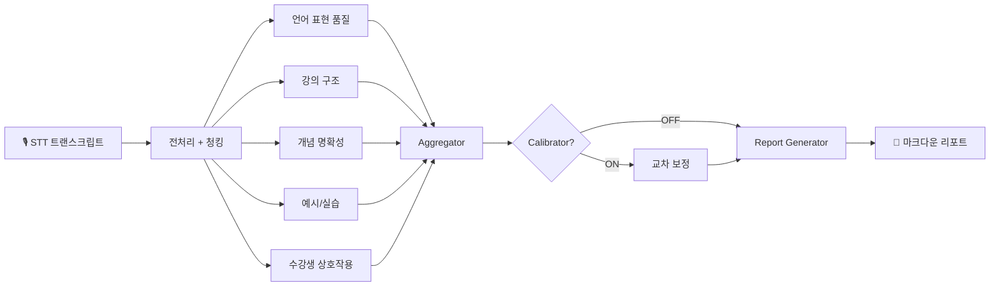
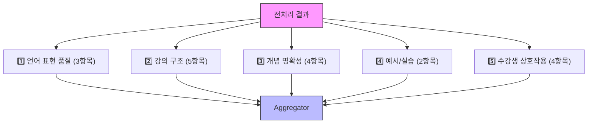
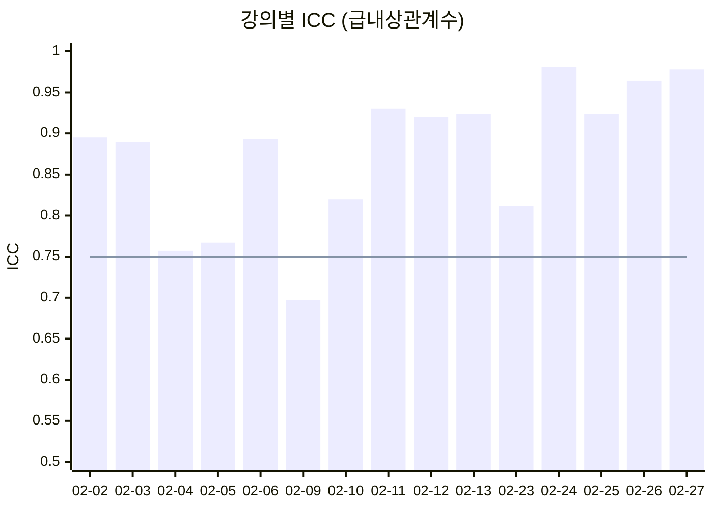
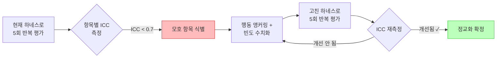
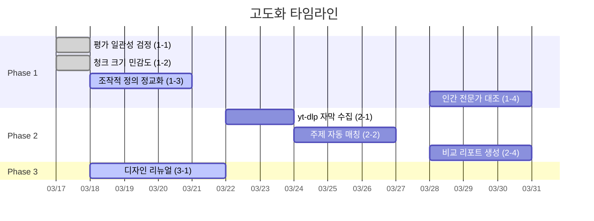

# 📊 AI 강의 분석 리포트

> **LangGraph 기반 에이전틱 강의 평가 파이프라인 + 대시보드**
>
> `React 19` · `LangGraph` · `FastAPI` · `GPT-4o` · `Claude` · `Supabase`

## 🎯 이 프로젝트가 풀려는 문제

"오늘 강의 어땠나요?"

이 질문에 보통은 수강생 설문으로 답해요. 그런데 설문은 주관적이고, 매번 같은 기준으로 측정하기 어렵고, 강사에게 구체적으로 뭘 바꾸라고 말해주지 못해요.

하지만 우리 시스템은 다르게 접근해요. **강의 녹음을 텍스트로 바꾼 다음, AI가 직접 읽고 18개 항목으로 채점해요.** "비유를 몇 번 썼는지", "이해 확인 질문을 얼마나 자주 했는지", "학습 목표를 처음에 안내했는지" — 사람이 강의를 들으면서 체크하는 걸 LLM이 대신 해주는 거예요.

백엔드 부트캠프 21기(Java, KDT) 15개 강의를 대상으로 3개 AI 모델(GPT-4o mini, Claude Opus, Claude Sonnet)이 교차 평가한 결과를 대시보드에서 바로 확인할 수 있어요.

---

## ⚙️ 시스템이 동작하는 방식

### 한 문장으로 요약하면

> 강의 녹취록이 들어오면 → 30분 단위로 쪼개고 → 5개 카테고리 평가자가 동시에 읽고 점수를 매기고 → 가중 평균을 내고 → 리포트를 만들어요.




### Step 1. 전처리 — 스크립트를 시간 단위로 잘라요

강의 STT 트랜스크립트는 보통 3~4시간, 수천 줄이에요. 이걸 통째로 LLM에 넣을 수 없으니까 **시간 윈도우 기반으로 청킹**해요.

```
원본 트랜스크립트 (3시간, 2000줄)
    ↓ chunk_by_time_window(window=30분, overlap=5분)
    ↓
[청크 0] 00:00 ~ 00:30  (도입부)
[청크 1] 00:25 ~ 00:55  (← 5분 겹침)
[청크 2] 00:50 ~ 01:20
    ...
[청크 N] 마지막 구간
```

왜 토큰 수가 아니라 시간으로 자를까요? 강의에서는 "도입부에서 학습 목표를 안내했는지", "마무리 요약이 있는지" 같은 **시간 위치에 따른 평가**가 중요하기 때문이에요. 토큰으로 자르면 강의 흐름이 끊겨요.

5분 오버랩을 두는 이유도 있어요. 어떤 설명이 29분 50초에 시작해서 31분 10초에 끝나면, 오버랩 없이는 두 청크 어디에서도 완전한 설명을 볼 수 없거든요.

### Step 2. 병렬 평가 — 5개 카테고리가 동시에 채점해요

여기가 LangGraph의 핵심이에요. 평가를 순서대로 하면 느리니까, 5개 카테고리 평가자를 **동시에(fan-out)** 돌려요.




각 평가자는 이렇게 일해요:

1. 자기 카테고리의 **하네스(harness)**를 읽어요 — 마크다운 파일에 "이 항목은 이렇게 평가하세요"라는 프롬프트가 들어 있어요
2. 하네스에 정의된 `chunk_focus`에 따라 청크를 골라요 — `first`면 도입부만, `last`면 마무리만, `all`이면 전체
3. 고른 청크마다 OpenAI API를 호출해서 점수(1-5), 근거, 추론, 신뢰도를 JSON으로 받아요
4. 여러 청크에서 받은 점수를 **평균**내서 최종 항목 점수를 만들어요

중요한 건 **하네스가 코드가 아니라 마크다운**이라는 점이에요. `category_3_clarity.md` 파일 하나만 수정하면 평가 기준이 바뀌어요. 코드를 고칠 필요가 없어요. 새로운 카테고리 파일(`category_6_xxx.md`)을 만들기만 하면 빌더가 자동으로 6번째 평가 노드를 추가해요.

### Step 3. 집계 — 가중 평균으로 종합해요

18개 항목의 점수가 다 나오면, Aggregator가 가중 평균을 계산해요. 모든 항목이 같은 무게를 갖지 않아요 — "이해 확인 질문을 하는지"(HIGH)는 "마무리 요약이 있는지"(LOW)보다 더 중요하게 반영돼요.

```
가중치: HIGH = 3, MEDIUM = 2, LOW = 1

가중 평균 = Σ(점수 × 가중치) / Σ(가중치)
```

이 노드에는 LLM 호출이 없어요. 순수 연산이에요. 5개 병렬 평가자가 모두 끝나야 실행되는 **동기화 지점**이기도 해요.

### Step 4. 리포트 생성 — 숫자를 말로 바꿔요

점수표만 주면 강사는 "그래서 뭘 바꾸라는 거지?"가 돼요. Report Generator가 모든 점수와 근거를 LLM에 넘겨서 자연어 리포트를 만들어요.

```
입력: 18개 항목 점수 + 근거 + 추론
    ↓ LLM (GPT-4o)
출력: {
  "report_markdown": "# 강의 평가 리포트\n\n## 종합 평가\n...",
  "strengths": ["개념 정의가 명확해요", "실습 연계가 자연스러워요"],
  "improvements": ["습관적 반복 표현을 줄여보세요", "이해 확인 질문을 더 자주 해보세요"],
  "recommendations": ["핵심 개념을 설명한 뒤 30초 멈추고 질문해보세요"]
}
```

---

## 실험 프레임워크 — "이 점수를 믿어도 될까?"

AI가 채점한 점수를 강사에게 "당신의 강의는 3.2점이에요"라고 말하려면, 그 3.2점이 믿을 만한지 먼저 확인해야 해요. 이 프로젝트에는 그걸 검증하는 **실험 프레임워크**가 들어 있어요.

### 실험을 이렇게 돌려요

```python
# 이렇게 실행하면:
python3 scripts/run_batch.py --model gpt-4o-mini --passes 3 --chunk-minutes 30

# 안에서는 이런 일이 일어나요:
# 1. ExperimentConfig가 만들어져요 (모델, 온도, 청크 크기, 반복 횟수)
# 2. 15개 강의 × 3회 반복 = 45번 파이프라인이 돌아가요
# 3. 각 결과가 experiments/{id}/results/ 에 JSON으로 저장돼요
# 4. 반복 실행 간 신뢰도 메트릭(ICC, Kappa, Alpha)이 자동으로 계산돼요
```

### 신뢰도를 이렇게 측정해요


| 메트릭                        | 뭘 측정하나요                          | 어떻게 읽나요                      |
| -------------------------- | -------------------------------- | ---------------------------- |
| **ICC** (급내상관계수)           | 같은 모델로 반복 평가했을 때 얼마나 같은 점수가 나오는지 | > 0.75 Good, > 0.9 Excellent |
| **Cohen's Weighted Kappa** | 두 평가 결과가 얼마나 일치하는지 (이견 크기도 반영)   | > 0.6 Substantial            |
| **Krippendorff's Alpha**   | 여러 평가자가 얼마나 합의하는지                | > 0.8 Reliable               |
| **SSI** (점수안정성지수)          | 반복할 때마다 점수가 얼마나 흔들리는지            | > 0.85 Stable                |


Cohen's Kappa의 **가중치(quadratic weighting)**가 핵심이에요. 4점 vs 5점 불일치(1점 차)보다 1점 vs 5점 불일치(4점 차)를 훨씬 크게 패널티로 줘요. 단순히 "몇 개 맞았나"로는 잡을 수 없는 차이예요.

### 📊 실험 결과 요약

두 가지 실험을 돌려서 시스템의 신뢰성을 검증했어요.

#### 실험 1. 평가 일관성 — "같은 강의를 3번 채점하면 같은 점수가 나올까?"

GPT-4o-mini로 15개 강의를 각 3회씩 반복 평가했어요.



| 메트릭 | 결과 | 판정 |
|--------|:----:|:----:|
| ICC (평균) | **0.877** | ✅ Good |
| Cohen's Kappa | **0.883** | ✅ Almost Perfect |
| Krippendorff's Alpha | **0.873** | ✅ Reliable |
| SSI | **0.974** | ✅ Very Stable |

> **결론:** H₀ 기각. GPT-4o-mini는 동일 강의에 대해 **높은 수준의 평가 일관성**을 보여줘요. 15개 강의 중 87%가 ICC > 0.75 (Good 이상)예요.

#### 실험 2. 청크 크기 — "30분으로 자르는 것과 15분으로 자르는 것, 차이가 있을까?"

같은 15개 강의를 30분 청크 vs 15분 청크로 평가하고 대응표본 t-test를 돌렸어요.

```mermaid
xychart-beta
    title "청크 크기별 평가 점수 비교"
    x-axis ["02-02","02-03","02-04","02-05","02-06","02-09","02-10","02-11","02-12","02-13","02-23","02-24","02-25","02-26","02-27"]
    y-axis "가중 평균 점수" 2.5 --> 3.8
    bar [2.978, 2.956, 3.333, 3.156, 3.178, 3.511, 3.511, 3.156, 3.333, 3.333, 3.400, 3.356, 2.822, 3.356, 3.289]
    bar [3.156, 2.867, 2.867, 3.111, 3.022, 3.111, 3.244, 3.022, 3.089, 2.978, 3.133, 3.067, 2.911, 2.933, 2.978]
```



| 통계량 | 결과 | 판정 |
|--------|:----:|:----:|
| 30분 평균 | 3.245 | — |
| 15분 평균 | 3.033 | — |
| **t(14)** | **4.421** | — |
| **p-value** | **0.0006** | ✅ p < 0.001 |
| **Cohen's d** | **1.142** | 큰 효과 (large) |

> **결론:** H₀ 기각. 청크 크기가 점수에 **유의미한 영향**을 줘요 (p<0.001). 30분 청크가 15분보다 평균 +0.21점 높았어요. 비교 시 반드시 같은 청크 크기를 써야 해요.

📄 [상세 분석 보고서 →](docs/experiment_results_midterm.md)

---

## 💡 주요 기능

- **18개 항목 자동 평가** — 언어 품질, 강의 구조, 개념 명확성, 예시/실습, 상호작용
- **3모델 교차 평가** — GPT-4o mini, Claude Opus, Claude Sonnet
- **역할 기반 UI** — 운영자는 전체 KPI와 히트맵을, 강사는 내 강의에 집중해서 볼 수 있어요
- **데이터 분석(EDA)** — 발화량, 화자 구성, 소통 빈도, 습관 표현, 수업 흐름
- **AI 심층 분석** — Claude Opus가 트랜스크립트를 직접 읽고 교수법 특징을 분석해요
- **강의 비교** — 2개 강의를 나란히 놓고 카테고리별로 비교해요
- **점수 추이** — 카테고리별로 시간에 따라 어떻게 변하는지 추적해요
- **항목별 분석** — 18개 항목 중 하나를 골라 전 강의에 걸쳐 분석해요
- **외부 연동** — 구글 드라이브에서 파일을 가져오고, 노션에 결과를 내보낼 수 있어요
- **GitHub Actions** — 파일만 올리면 자동으로 평가하고 결과를 배포해요
- **반응형 디자인** — 데스크탑에서는 사이드바, 모바일에서는 하단 탭바로 볼 수 있어요

---

## 🛠️ 기술 스택


| 구분     | 기술                                                    |
| ------ | ----------------------------------------------------- |
| 프론트엔드  | React 19, Vite, TypeScript, Tailwind CSS v4, Recharts |
| 백엔드    | Python 3.11, LangGraph, FastAPI                       |
| LLM    | OpenAI GPT-4o mini, Claude Opus, Claude Sonnet        |
| 인증     | Supabase Auth (Google, Notion OAuth)                  |
| 데이터베이스 | Supabase (PostgreSQL)                                 |
| 서버리스   | Supabase Edge Functions (Deno)                        |
| CI/CD  | GitHub Actions (평가 자동화 + Pages 배포)                    |
| 배포     | GitHub Pages                                          |


---

## 🔍 코드가 실제로 하는 일

<details>
<summary><b>프론트엔드 — 데이터를 보여주는 11개 화면</b></summary>

프론트엔드는 React 19 + Vite로 빌드한 SPA예요. 평가 결과 JSON을 `public/data/`에서 가져와서 시각화해요.

```
App.tsx가 하는 일:
  1. "/" 경로로 오면 → RoleSelectPage를 보여줘요 (로그인 또는 게스트 역할 선택)
  2. 로그인이 끝나면 → RequireRole 래퍼가 보호하는 라우트로 이동해요
  3. Layout 컴포넌트가 사이드바(데스크탑) 또는 하단 탭바(모바일)를 그려요
  4. 각 페이지가 data.ts의 함수를 호출해서 JSON 데이터를 가져와요
```

`data.ts`는 프론트엔드의 데이터 계층이에요. 모든 페이지가 이 파일의 함수로 데이터를 가져와요:

```
getAllLectures()          → 15개 강의 메타데이터
getEvaluation(date)      → 특정 날짜 강의의 평가 결과 (18개 항목 점수 + 근거)
getEvaluationByModel()   → 모델별 평가 결과 (GPT-4o-mini / Opus / Sonnet)
getTranscriptStats()     → 발화량, 발화 속도 등 정량 데이터
getFillerWords()         → "이제", "그래서" 같은 습관 표현 빈도
```

</details>

<details>
<summary><b>백엔드 API — 프론트엔드와 파이프라인을 이어줘요</b></summary>

FastAPI 서버가 REST API를 제공해요. 핵심 엔드포인트는 이래요:

```
POST /api/evaluate
  → 프론트엔드에서 "평가 실행" 버튼을 누르면 호출돼요
  → ExperimentConfig를 만들어서 LangGraph 파이프라인을 실행해요
  → 결과를 JSON으로 돌려줘요
  → ⚠️ 지금은 동기 방식이라 — 강의 15개를 평가하면 몇 분 걸려요

GET  /api/experiments
  → 이전에 돌린 실험 목록을 보여줘요 (모델, 날짜, 평균 점수)

POST /api/settings
  → API 키나 모델 설정을 런타임에 바꿀 수 있어요
```

구글 드라이브/노션 OAuth 콜백도 여기서 처리해요. 드라이브에서 트랜스크립트 파일을 가져오고, 노션에 평가 결과를 내보내는 흐름이에요.

</details>

<details>
<summary><b>하네스 — 평가 기준이 코드가 아니라 문서예요</b></summary>

평가 기준은 `src/harnesses/` 폴더의 마크다운 파일에 정의돼 있어요. YAML frontmatter에 항목 메타데이터가, 본문에 LLM 프롬프트가 들어 있어요.

```markdown
# category_3_clarity.md 구조

---
items:
  - item_id: "3.1"
    name: "개념 정의"
    weight: HIGH           ← 가중치
    chunk_focus: all        ← 모든 청크에서 평가해요
    merge_strategy: average ← 청크별 점수를 평균내요
---

# 역할
당신은 교육 품질 전문 강의 평가자예요...

## 3.1 개념 정의 (가중치: 높음)
**세부 기준**: 핵심 개념을 처음 나왔을 때 명확하게 정의하는지
**5점**: 새로운 개념이 나올 때마다 명시적으로 정의해줘요...
**4점**: 대부분의 핵심 개념에 정의를 붙여주고 있어요...
...
```

이 구조가 좋은 이유는 **개발자가 아니어도 평가 기준을 바꿀 수 있다**는 거예요. 마크다운 파일만 고치면 돼요. 새 카테고리를 추가하고 싶으면 `category_6_xxx.md` 파일을 만들기만 하면 빌더가 자동으로 6번째 평가 노드를 추가해요.

</details>

<details>
<summary><b>LangGraph 토폴로지 — 그래프가 알아서 만들어져요</b></summary>

`builder.py`의 `build_evaluation_graph()`가 하는 일을 풀어서 쓰면 이래요:

```
1. harnesses/ 폴더에서 category_*.md 파일을 전부 찾아요
2. 파일마다 make_evaluator()를 호출해서 평가 노드를 만들어요
3. StateGraph에 노드를 등록해요:
   - "preprocessor" → 전처리 노드
   - "eval_category_1_language" → 언어 품질 평가 노드
   - "eval_category_2_structure" → 강의 구조 평가 노드
   - ... (하네스 파일 수만큼)
   - "aggregator" → 집계 노드
   - "calibrator" → 보정 노드 (선택)
   - "report_generator" → 리포트 생성 노드
4. 노드 사이에 간선(edge)을 연결해요:
   - preprocessor → 모든 eval 노드로 퍼져요 (fan-out)
   - 모든 eval 노드 → aggregator로 모여요 (fan-in)
   - aggregator → calibrator 또는 report_generator
   - report_generator → END
5. 컴파일해서 실행할 수 있는 그래프를 돌려줘요
```

</details>

<details>
<summary><b>State — 모든 노드가 같은 상태를 공유해요</b></summary>

LangGraph에서 노드끼리 데이터를 주고받을 때 **하나의 공유 상태(TypedDict)**를 써요. `state.py`의 `EvaluationState`가 그 역할을 해요.

```
EvaluationState = {
  # 입력
  lecture_date, transcript_path,

  # 전처리 결과
  raw_text, metadata, chunks,

  # 평가 결과 (병렬 노드들이 여기에 써요)
  category_scores: { "1. 언어 표현 품질": [ItemScore, ...], ... },

  # 집계 결과
  weighted_average, category_averages,

  # 리포트
  report_markdown, strengths, improvements, recommendations,

  # 비용 추적
  token_usage, cost_usd
}
```

`category_scores`에는 **커스텀 머저(reducer)**가 붙어 있어요. 5개 평가 노드가 동시에 결과를 쓸 때 충돌 없이 안전하게 합쳐져요. 각 노드는 자기 카테고리 키만 쓰고, 머저가 기존 딕셔너리에 새 키를 추가하는 방식이에요.

</details>

---

## 📋 평가 체계


| 카테고리          | 항목 수 | 핵심(HIGH) | 주요 평가 내용                 |
| ------------- | ---- | -------- | ------------------------ |
| 1. 언어 표현 품질   | 3    | 1        | 반복 표현, 발화 완결성, 언어 일관성    |
| 2. 강의 도입 및 구조 | 5    | 2        | 학습 목표, 복습 연계, 설명 순서, 마무리 |
| 3. 개념 설명 명확성  | 4    | 2        | 개념 정의, 비유/예시, 발화 속도      |
| 4. 예시 및 실습 연계 | 2    | 2        | 예시 적절성, 이론→실습 연결         |
| 5. 수강생 상호작용   | 4    | 3        | 이해 확인, 참여 유도, 질문 응답      |


---

## 📁 프로젝트 구조

```
├── frontend/              # React 대시보드 (Vite + TypeScript)
│   └── src/
│       ├── app/            # 대시보드, 강의 상세 페이지
│       ├── pages/          # EDA, 모델비교, 설정, 비교, 추이 등 11개 페이지
│       ├── components/     # 레이아웃(사이드바, 헤더) + 공유(ScoreBadge, FeedbackCard)
│       ├── contexts/       # AuthContext(OAuth), RoleContext(역할+설정 동기화)
│       └── lib/            # data.ts(데이터 fetch), api.ts(FastAPI 통신), utils.ts
├── src/                    # LangGraph 평가 파이프라인
│   ├── graph/
│   │   ├── builder.py      # 그래프 토폴로지 빌더 (하네스를 찾아서 노드로 등록)
│   │   ├── state.py        # EvaluationState 정의 (커스텀 머저 포함)
│   │   └── nodes/          # preprocessor, category_evaluator, aggregator,
│   │                       # calibrator, report_generator
│   ├── harnesses/          # MD 기반 프롬프트 하네스 (5개 카테고리 + 보정 + 리포트)
│   ├── chunking/           # 시간 윈도우 청킹 알고리즘
│   ├── scoring/            # 가중치 집계 로직
│   └── experiment/         # 실험 러너, 설정, 비교기, 신뢰도 메트릭(ICC, Kappa, Alpha)
├── api/                    # FastAPI 서버 (평가 실행, OAuth, 설정)
├── supabase/               # DB 스키마 + Edge Functions
├── .github/workflows/      # 배포(Pages) + 평가 자동화(Actions)
├── scripts/                # run_single.py, run_batch.py, export_frontend_data.py
├── experiments/            # 실험 결과 저장소 (config + results + reports + metrics)
└── tests/                  # 단위 테스트 (46개)
```

---

## 🚀 시작하기

### 프론트엔드

```bash
cd frontend
npm install
npm run dev
# http://localhost:3000 에서 확인할 수 있어요
```

### 백엔드 API

```bash
cp .env.example .env
# .env에 OPENAI_API_KEY를 넣어주세요

pip install -r requirements.txt
pip install -r api/requirements.txt
uvicorn api.main:app --reload --port 8000
```

### 평가 실행하기

```bash
# 강의 하나만 평가하기
python3 scripts/run_single.py --date 2026-02-02 --model gpt-4o-mini

# 15개 강의 한번에 평가하기
python3 scripts/run_batch.py --model gpt-4o-mini --passes 1

# 신뢰도 검증을 위해 3번 반복 평가하기
python3 scripts/run_batch.py --model gpt-4o-mini --passes 3 --no-calibrator

# 청크 크기를 바꿔서 실험하기
python3 scripts/run_batch.py --model gpt-4o-mini --chunk-minutes 15

# 결과를 프론트엔드 JSON으로 내보내기
python3 scripts/export_frontend_data.py --experiment-id <ID>
```

### GitHub Actions로 평가하기

GitHub 레포 → Actions → "Evaluate Lecture" → Run workflow

- `transcript_filename`: 파일명
- `date`: 강의 날짜
- `model`: gpt-4o-mini (기본)

⚠️ GitHub Secrets에 `OPENAI_API_KEY`를 먼저 넣어주세요

### 테스트 돌리기

```bash
pytest -v
```

---

## 📦 데이터

- **15개** 강의 STT 트랜스크립트 (2026.02.02 ~ 02.27)
- **백엔드 부트캠프 21기**: Java (KDT)
- **3개 AI 모델** × 15개 강의 = **45개** 평가 결과
- **EDA**: 실제 트랜스크립트에서 뽑은 정량 분석 (22,756줄)
- **AI 심층 분석**: Claude Opus가 트랜스크립트를 직접 읽고 정성 분석한 결과

---

## 🖥️ 대시보드 페이지


| 페이지     | 경로            | 설명                             |
| ------- | ------------- | ------------------------------ |
| 대시보드    | /dashboard    | 전체 현황, KPI, 히트맵, 추이            |
| 강의 평가   | /lectures     | 15개 강의 목록 + 모델 전환              |
| 데이터 분석  | /eda          | 발화량, 화자, 소통, 습관, 수업흐름, AI 심층분석 |
| 평가 기준   | /checklist    | 18개 항목 시각화                     |
| 모델 비교   | /experiments  | 3모델 점수 비교 + 카테고리 차트            |
| 강의 비교   | /compare      | 2개 강의를 나란히 비교                  |
| 점수 추이   | /trends       | 카테고리별 시계열 변화                   |
| 항목별 분석  | /items        | 특정 항목의 전 강의 점수 + 근거            |
| 설정      | /settings     | API 키, 모델, 파라미터, 파일 업로드        |
| 연동 설정   | /integrations | 구글 드라이브, 노션 연동                 |
| 프로젝트 소개 | /about        | 아키텍처, 기술스택, 통계                 |


---

## 🌐 배포

**GitHub Pages** — `main` 브랜치에 push하면 자동으로 빌드하고 배포해요 (GitHub Actions)

**Supabase** — Auth, DB, Edge Functions

---

## 📄 문서

| 문서 | 설명 |
|------|------|
| [기획서](docs/기획서.md) | 프로젝트 배경, 목표, 아키텍처, 평가 체계, 일정 |
| [현재 진행상황](docs/현재-진행상황.md) | 완료/진행 중/다음 단계 작업 목록, 주요 성과 수치 |
| [실험 결과 보고서](docs/experiment_results_midterm.md) | 신뢰도 검증 실험 상세 분석 |
| [인터페이스 계약서](docs/interface_contract.md) | 프론트-백엔드 API 스펙 |

---

## 👥 팀

> 멋쟁이사자처럼 AXP 인턴 1-2조 · 4주 프로젝트 · 2026.03 ~

<table>
  <tr>
    <td align="center" width="250">
      <b>손영진</b><br/>
      <sub>Project Lead · Frontend · 기획</sub><br/><br/>
      프로젝트 기획 및 전체 설계<br/>
      프론트엔드 대시보드 (React 19)<br/>
      UI/UX 디자인 · 발표 영상 제작<br/>
      AI 평가 하네스 설계
    </td>
    <td align="center" width="250">
      <b>안례진</b><br/>
      <sub>Backend · 기술 기획</sub><br/><br/>
      시스템 아키텍처 설계<br/>
      LangGraph 파이프라인 구현<br/>
      FastAPI 서버 · 실험 설계<br/>
      AI 평가 하네스 품질 관리
    </td>
    <td align="center" width="250">
      <b>정지훈</b><br/>
      <sub>AI Engineer · Backend</sub><br/><br/>
      LLM 평가 파이프라인 최적화<br/>
      AI 하네스 품질 평가 및 정교화<br/>
      신뢰도 메트릭 구현 (ICC, Kappa, Alpha)<br/>
      백엔드 성능 개선
    </td>
    <td align="center" width="250">
      <b>이은비</b><br/>
      <sub>Data Analysis · QA</sub><br/><br/>
      강의 데이터 전처리 및 EDA<br/>
      평가 결과 데이터 검증<br/>
      실험 데이터 정리 및 시각화<br/>
      품질 보증 (QA)
    </td>
  </tr>
</table>

---

## 🗺️ Next: 고도화 로드맵

> 핵심 방향: **"이 평가를 믿어도 될까?"** — 교육 운영자와 강사가 AI 평가 결과를 받아들이려면, 평가 도구 자체가 타당하고 일관적이라는 걸 먼저 보여줘야 해요.

---

### 🔬 Phase 1. 평가 신뢰성 검증

AI 평가 결과가 "믿을 만한지"를 통계로 확인해요.


| #   | 과제                          | 설명                                                                            | 난이도 | 담당      |
| --- | --------------------------- | ----------------------------------------------------------------------------- | --- | ------- |
| 1-1 | **평가 일관성 검정 (Test-Retest)** | 같은 모델로 같은 강의를 3번 반복 평가해요 → ICC, Cohen's Kappa로 일관성을 측정해요                      | ★★  | YJ99Son |
| 1-2 | **청크 크기 민감도 분석**            | 30분 vs 15분 청크가 점수에 영향을 주는지 확인해요 → 대응표본 t-test                                 | ★★  | YJ99Son |
| 1-3 | **평가 기준 조작적 정의 정교화**        | 점수 기준(1~5점)의 모호한 부분을 찾아서 관찰 가능한 행동 지표로 바꿔요                                    | ★★★ |         |
| 1-4 | **인간 전문가 대조 검증**            | 교수법 전문가 2~3명이 직접 평가한 결과와 AI 평가를 비교해요 (Pearson r, Bland-Altman)                | ★★★ |         |
| 1-5 | **모델 간 교차 신뢰도**             | GPT-4o-mini와 Claude Sonnet이 같은 강의를 얼마나 비슷하게 평가하는지 확인해요 → Krippendorff's Alpha | ★★  |         |
| 1-6 | **Temperature 민감도 분석**      | temperature만 바꿔서(0.0, 0.1, 0.3, 0.5) 점수가 얼마나 흔들리는지 확인해요                       | ★   |         |


#### 1-3 조작적 정의를 어떻게 정교화하나요?

**문제가 뭔가요?**

지금 하네스의 점수 기준에는 LLM이 자기 마음대로 해석할 수 있는 표현이 많아요. 같은 프롬프트를 받아도 "적절한"을 어떻게 읽느냐에 따라 3점과 4점이 갈려요.

**현재 하네스에서 찾은 모호 표현들:**


| 유형         | 예시 (지금)                 | 뭐가 문제인가요                        |
| ---------- | ----------------------- | ------------------------------- |
| **정도 부사**  | "자주", "가끔", "거의", "대체로" | 몇 번이 "자주"이고 몇 번이 "가끔"인지 숫자가 없어요 |
| **주관 형용사** | "적절한", "효과적인", "충분한"    | 기준이 해석하는 사람마다 달라져요              |
| **이중 조건**  | "빈도가 낮거나 일부 비유가 부적절함"   | 둘 중 하나만 해당해도 3점인지 알 수 없어요       |
| **암묵적 비교** | "이해에 도움이 됨"             | 뭐랑 비교해서 도움이 되는 건지 기준이 없어요       |


**3단계로 고쳐나가요:**



**Step 1. 행동 앵커링 — 모호한 말을 눈에 보이는 행동으로 바꿔요**

```
[지금] 3.2 비유 및 예시 활용
  3점: "비유나 예시가 있으나 빈도가 낮거나 일부 비유가 부적절함"

[바꾸면] 3.2 비유 및 예시 활용
  3점: "추상적 개념(클래스, 인터페이스, 디자인 패턴 등)이 3개 이상
        나오는 구간에서 비유/실생활 예시를 1~2회만 썼거나,
        비유의 source domain이 target concept과 구조적으로
        대응되지 않는 경우
        (예: 'List는 박스 같은 거예요'처럼 핵심 특성인
        순서/인덱스를 반영하지 않는 비유)"
```

**Step 2. 빈도 임계값 수치화 — "자주", "가끔"을 숫자로 바꿔요**

```
[지금] 5.2 이해 확인 질문
  4점: "주요 개념 설명 후 이해 확인 질문을 자주 함"
  3점: "이해 확인 질문이 있으나 빈도가 낮거나 형식적"

[바꾸면] 5.2 이해 확인 질문
  4점: "30분 청크당 이해 확인 질문 3회 이상. 이 중 50% 이상이
        내용 확인형('어떤 값이 출력될까요?')이고 단순 확인형
        ('되셨어요?')이 아닌 경우"
  3점: "30분 청크당 이해 확인 질문 1~2회. 또는 3회 이상이지만
        80% 이상이 단순 확인형('되셨어요?', '괜찮으세요?')인 경우"
```

**Step 3. 판별 테스트 — 바꾼 게 실제로 효과가 있는지 확인해요**

정교화한 기준으로 다시 평가했을 때 **모호했던 구간(3점 vs 4점 경계)의 ICC가 올라가는지** 측정해요.

```
1. 현재 하네스로 같은 강의를 5번 반복 → 항목별 ICC 측정 → 모호한 항목 찾기 (ICC < 0.7)
2. 그 항목의 점수 기준을 행동 앵커링 + 수치화로 고쳐요
3. 고친 하네스로 같은 강의를 5번 반복 → ICC 다시 측정
4. ICC가 얼마나 올랐는지로 정교화 효과를 확인해요
```

**먼저 고칠 항목 (모호성이 높은 순):**


| 항목             | 지금 모호한 표현       | 이렇게 바꿀 수 있어요             |
| -------------- | --------------- | ------------------------ |
| 3.2 비유 및 예시 활용 | "적절한 비유", "효과적" | 구조적으로 대응되는지 + 빈도 숫자      |
| 5.3 참여 유도      | "적극적으로", "형식적"  | 참여 유형을 분류하고 빈도를 정해요      |
| 5.4 질문 응답 충분성  | "충분하게", "상세하고"  | 답변 길이 + 관련 개념을 확장했는지     |
| 2.3 설명 순서      | "논리적", "자연스러움"  | 선수 개념 → 후속 개념 순서를 위반한 횟수 |
| 3.3 선행 개념 확인   | "가끔", "자주"      | 심화 내용으로 넘어가는 지점 대비 확인 비율 |


---

### 🎯 Phase 2. 외부 벤치마크 비교 (YouTube 강의 대조군)

절대 점수만으로는 "3.2점이면 잘하는 건가?"를 알 수 없어요. **같은 주제의 외부 강의를 벤치마크로 가져와서 비교**하면 맥락이 생겨요.


| #   | 과제                     | 설명                                                                           | 난이도 | 담당  |
| --- | ---------------------- | ---------------------------------------------------------------------------- | --- | --- |
| 2-1 | **yt-dlp 자막 수집 파이프라인** | `yt-dlp --write-auto-sub --sub-lang ko`로 유튜브 자동자막을 가져오고 → VTT를 STT 포맷으로 변환해요 | ★★  |     |
| 2-2 | **주제 자동 매칭**           | 입력 강의의 주제를 LLM이 뽑아내고 → `yt-dlp "ytsearch5:{주제} 강의"`로 비슷한 강의를 찾아요             | ★★★ |     |
| 2-3 | **동일 파이프라인 평가**        | 유튜브 강의도 같은 18항목 파이프라인에 넣어서 동일 기준으로 점수를 매겨요                                   | ★★  |     |
| 2-4 | **비교 리포트 생성**          | "이 강사 vs 유튜브 Top N" 레이더 차트 + 카테고리별 강점/약점 + 차별점을 자동으로 만들어요                    | ★★★ |     |
| 2-5 | **프론트엔드 벤치마크 페이지**     | 비교 결과를 대시보드에서 바로 볼 수 있게 — 레이더 오버레이, 항목별 막대 비교, 인사이트 카드                       | ★★  |     |


**이렇게 쓸 수 있어요:** "이 강사의 개념 설명은 유튜브 인기 강의 대비 상위 20%이지만, 상호작용은 하위 40%예요" 같은 맥락 있는 피드백을 줄 수 있어요.

---

### 🎨 Phase 3. UI/UX 고도화

평가 결과를 더 잘 전달하고, 강사가 실제로 쓰고 싶은 도구로 만들어요.


| #   | 과제                    | 설명                                              | 난이도 | 담당  |
| --- | --------------------- | ----------------------------------------------- | --- | --- |
| 3-1 | **디자인 시스템 리뉴얼**       | 현재 UI를 전문 디자인 스킬로 다시 만들어요 (색상, 타이포, 카드, 차트 스타일) | ★★★ |     |
| 3-2 | **강사용 액션 플랜 뷰**       | 평가 결과를 "다음 강의에서 이것만 바꿔보세요" 형태로 보여줘요             | ★★  |     |
| 3-3 | **시계열 개선 추적**         | 강사가 피드백을 반영한 뒤 점수 변화를 눈으로 확인할 수 있어요             | ★   |     |
| 3-4 | **PDF/DOCX 리포트 내보내기** | 대시보드 내용을 깔끔한 문서로 뽑아서 관리자에게 보고할 수 있어요            | ★★  |     |


---

### 🔧 Phase 4. 파이프라인 고도화


| #   | 과제           | 설명                                                            | 난이도  | 담당  |
| --- | ------------ | ------------------------------------------------------------- | ---- | --- |
| 4-1 | **프롬프트 버저닝** | 하네스가 바뀐 이력을 관리해서, 프롬프트 수정이 점수에 준 영향을 추적해요                     | ★★   |     |
| 4-2 | **비용 최적화**   | 규칙으로 처리할 수 있는 항목(반복 표현, 발화 속도)을 Python으로 전환해서 LLM 호출을 50% 줄여요 | ★★★  |     |
| 4-3 | **실시간 평가**   | 강의 중 실시간 STT → 실시간 피드백 (WebSocket 기반)                         | ★★★★ |     |
| 4-4 | **다국어 지원**   | 영어 강의도 평가할 수 있게 해서 글로벌 교육 플랫폼으로 확장해요                          | ★★   |     |


---

### 📅 우선순위



## 라이선스

MIT