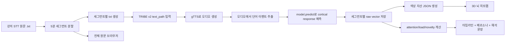
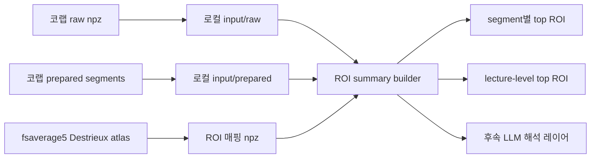

# TRIBE v2 수강자 반응 시뮬레이션

> 강의 STT 원문을 TRIBE v2로 세그먼트 단위 추론해, 시간축별 cortical response를 3D 뇌 히트맵과 원문 브라우저로 탐색하는 실험 기능

<br/>

## 1. 왜 이 기능을 붙였나

기존 평가는 `18개 항목 점수 + 근거 + 리포트` 중심이었다. 이 구조는 강의 품질을 비교적 안정적으로 점수화하는 데는 강하지만, "수강자가 어느 구간에서 따라오기 힘들었는지" 같은 **시간축 반응 변화**를 직접 보여주지는 못한다.

TRIBE v2 실험은 이 빈틈을 메우기 위한 별도 레이어다.

- 평가 파이프라인: 강의 전체를 기준으로 18개 항목을 채점
- TRIBE v2 시뮬레이션: 강의 흐름을 시간축으로 잘라 세그먼트별 반응 변화를 본다

즉 이 기능은 기존 평가를 대체하는 것이 아니라, **강의 리듬과 인지 부하 변화를 시각적으로 보강하는 보조 실험**이다.

<br/>

## 2. TRIBE v2는 무엇인가 — 모델 원리

### 한 줄 요약

> TRIBE v2는 Meta AI/FAIR이 **25명 피험자의 451.6시간 실제 fMRI 데이터**로 훈련한 뇌 인코딩 모델이다. 텍스트/오디오/비디오를 입력하면 fsaverage5 표면의 **10,242개 정점별 cortical response를 예측**한다.

### 논문

| | 제목 | 저자 | 연도 | 비고 |
|---|---|---|---|---|
| **v1** | *TRIBE: TRImodal Brain Encoder for whole-brain fMRI response prediction* (arXiv:2507.22229) | d'Ascoli, Rapin, Benchetrit, Banville, King | 2025 | **Algonauts 2025 뇌 모델링 대회 1위** |
| **v2** | *A foundation model of vision, audition, and language for in-silico neuroscience* | d'Ascoli, Rapin, Benchetrit, Brookes, Begany, Raugel, Banville, King | 2026 | Meta AI Research |

### 모델 구조 (3단계 파이프라인)

```
┌─────────────────────────────────────────────────────────────┐
│ Stage 1: Feature Extraction (frozen, 사전훈련된 인코더)         │
│                                                             │
│   텍스트 ──→ LLaMA 3.2-3B ──→ 2Hz 임베딩 (D=2048)            │
│   오디오 ──→ Wav2Vec-BERT 2.0 ──→ 2Hz 임베딩 (D=1024)        │
│   비디오 ──→ V-JEPA2 ViT-Giant ──→ 2Hz 임베딩 (D=1280)       │
├─────────────────────────────────────────────────────────────┤
│ Stage 2: Multimodal Fusion (학습 가능한 Transformer)           │
│                                                             │
│   3개 모달리티 concat → Linear Projector → D=384              │
│   Transformer Encoder: 8 layers, 8 heads                    │
│   100초 윈도우 단위 처리                                       │
├─────────────────────────────────────────────────────────────┤
│ Stage 3: Brain Mapping (Subject Block)                      │
│                                                             │
│   잠재 표현 → 1Hz decimation → SubjectLayers                 │
│   → 20,484 cortical vertices (fsaverage5)                   │
│   + 8,802 subcortical voxels                                │
│   5초 hemodynamic delay 보정 (HRF offset)                    │
└─────────────────────────────────────────────────────────────┘
```

### 훈련 데이터 — 실제 fMRI

| 데이터셋 | 피험자 | 자극 유형 | 시간 |
|---|---|---|---|
| Algonauts 2025 (Courtois NeuroMod) | 4명 | Friends 시즌 1-6 + 영화 4편 | 대규모 |
| Wen 2017 | 다수 | 자연 동영상 | 다수 |
| Lahner 2024 (BOLD Moments) | 10명 | 3초 자연 비디오 클립 | 다수 |
| Lebel 2023 | 8명 | 내러티브 팟캐스트/스토리 | 다수 |
| **합계** | **25명** | | **451.6시간** |

평가 데이터는 별도로 **720명, 1,117.7시간**의 fMRI를 사용했다.

### vertex-level 예측의 신경과학적 타당성

이 모델이 단순히 "텍스트에서 숫자를 만들어 뇌에 칠하는" 것이 아니라는 근거:

1. **모달리티별 공간 분리가 기존 신경과학과 일치**: Audio → 측두엽(청각 피질), Video → 후두엽(시각 피질), Text → 전두/두정엽(고차 인지). 이 패턴은 모델이 학습한 것이지 프로그래머가 규칙으로 넣은 것이 아니다.
2. **ICA 분석에서 5개 기능적 네트워크가 자발적으로 출현**: Primary Auditory, Language, Motion, DMN, Visual. 기존 fMRI 연구에서 잘 알려진 네트워크와 정확히 대응된다.
3. **고전적 뇌 영역 국소화 재현**: FFA(방추상 얼굴 영역), Broca 영역을 in-silico로 국소화하는 데 성공했다.
4. **Zero-shot 일반화**: 새로운 피험자 720명의 그룹 평균 반응을 예측할 때, 개별 피험자의 실제 fMRI보다 TRIBE의 예측이 그룹 평균에 더 가까웠다.

### 이 프로젝트에서의 사용 방식

이 프로젝트에서는 텍스트 경로를 사용한다.

```python
# 강의 세그먼트 텍스트 → TTS 음성 생성 → TRIBE v2 추론
events = model.get_events_dataframe(text_path=text_path)
preds, segments = model.predict(events=events)
mean_pred = preds.mean(axis=0)  # shape: (10242,)
```

이 `mean_pred`가 해당 세그먼트의 **vertex-level cortical response 예측**이다. 이것이 뇌 표면의 각 정점에 매핑되어 heatmap으로 시각화된다.

### 해석 범위의 제한

TRIBE v2의 예측이 실제 fMRI 데이터에 기반한 통계적 근사치라 하더라도, 다음 한계가 있다.

- **"평균 피험자" 예측**: 특정 학생 개인의 뇌 반응이 아니라 평균적 뇌 반응의 근사
- **fMRI 한계 승계**: BOLD 신호(혈류 변화)에 기반하므로 밀리초 단위 신경 역학은 포착 불가
- **훈련 데이터 편향**: 자연 영상(영화, 팟캐스트)으로 훈련 → 한국어 강의에 대한 직접 검증은 없음
- **텍스트→TTS 경로**: 실제 강사 음성이 아닌 합성 음성을 사용하므로 운율/감정 정보 손실

따라서 이 결과는 "실제 학생의 뇌 반응"이 아니라, **TRIBE v2가 예측하는 평균적 cortical response 기반의 탐색형 시뮬레이션**으로 소개한다.

<br/>

## 3. 전체 흐름



<br/>

## 4. 세그먼트는 무엇인가

### 세그먼트

이 기능에서 `세그먼트`는 강의 전체를 일정 시간 단위로 나눈 **분석 단위**다.

예를 들어 `5분 세그먼트`면:

- `09:00 ~ 09:05`
- `09:05 ~ 09:10`
- `09:10 ~ 09:15`

처럼 강의를 시간 구간으로 나눈다.

세그먼트 하나마다 아래가 한 세트로 생성된다.

- TRIBE 추론 1회
- 3D 뇌 색상 1세트
- `attention/load/novelty` 1세트
- 원문 브라우저의 한 묶음

### 컨텍스트 윈도우와 차이

이건 LLM의 `토큰 컨텍스트 윈도우`와는 다르다.

- 컨텍스트 윈도우: 모델이 한 번에 참고하는 입력 길이 제한
- 세그먼트: 우리가 시각화/해석을 위해 정한 시간 단위

TRIBE v2의 텍스트 경로는 내부적으로 `text -> TTS -> audio events -> predict`로 흐르기 때문에, 여기서는 토큰 제한보다 **시간 구간을 어떻게 나눌지**가 더 중요하다.

### 왜 5분으로 시작했나

5분은 발표용 인터랙션과 해석 가능성의 균형이 좋다.

- 1분 이하는 노이즈가 커지고 구간 수가 너무 많다
- 10분 이상은 반응 변화가 너무 뭉개진다
- 5분은 "어디서 반응이 올라가고 꺾였는지"를 보여주기 적당하다

향후에는 `1분 / 3분 / 5분 / 10분` 비교 실험으로 확장할 수 있다.

<br/>

## 5. TRIBE v2 텍스트 입력이 실제로 하는 일

TRIBE v2의 `text_path` 입력은 텍스트를 바로 예측하는 것이 아니다.

실제 흐름은 아래와 같다.

1. 텍스트 파일을 읽는다
2. `gTTS`로 오디오 MP3를 생성한다
3. 생성된 오디오에서 단어 단위 타이밍을 추출한다
4. 단어 이벤트를 feature extractor에 넣는다
5. `model.predict(events=df)`로 cortical response를 예측한다

즉 코랩 로그에 아래가 보이면 정상이다.

```text
INFO - Wrote TTS audio to .../audio.mp3
Extracting words from audio: ...
```

이건 에러가 아니라, 텍스트를 자연주의적 자극 형식으로 바꾸는 **정상 preprocessing 단계**다.

<br/>

## 6. 코랩 실행 순서

코랩 관련 파일은 [colab/tribev2-student-reaction](/Users/youngjinson/멋사-인턴/colab/tribev2-student-reaction) 아래에 있다.

### 6-1. Drive 템플릿 업로드

먼저 [drive_template](/Users/youngjinson/멋사-인턴/colab/tribev2-student-reaction/drive_template) 폴더를 통째로 Google Drive에 올리고 이름을 `tribev2-student-reaction`으로 맞춘다.

필수 입력 파일:

- `inputs/transcripts/2026-02-02_kdt-backendj-21th.txt`
- `inputs/transcripts/2026-02-09_kdt-backendj-21th.txt`
- `inputs/transcripts/2026-02-24_kdt-backendj-21th.txt`
- `inputs/metadata/강의 메타데이터.csv`

### 6-2. 노트북 실행 순서

1. `00_prepare_inputs.ipynb`
2. `01_run_tribev2.ipynb`
3. `02_build_brain_assets.ipynb`
4. `03_build_frontend_json.ipynb`

### 6-3. Hugging Face 준비

`01_run_tribev2.ipynb` 실행 전에는 아래가 필요하다.

- Hugging Face 로그인
- `read` access token 생성
- `meta-llama/Llama-3.2-3B` 접근 승인

TRIBE v2는 내부적으로 gated text encoder를 사용하므로, 설치만으로는 충분하지 않다.

<br/>

## 7. 코드 기준 핵심 지점

### 입력 준비

[00_prepare_inputs.ipynb](/Users/youngjinson/멋사-인턴/colab/tribev2-student-reaction/00_prepare_inputs.ipynb)

- 원본 txt를 읽는다
- `5분 세그먼트`로 자른다
- `segments.json`, `transcript.json`, `metadata.json`을 만든다

### 실제 TRIBE 추론

[01_run_tribev2.ipynb](/Users/youngjinson/멋사-인턴/colab/tribev2-student-reaction/01_run_tribev2.ipynb)

핵심 코드는 아래 흐름이다.

```python
model = TribeModel.from_pretrained("facebook/tribev2", cache_folder=CACHE_DIR)

events = model.get_events_dataframe(text_path=text_path)
preds, model_segments = model.predict(events=events)
mean_pred = preds.mean(axis=0).astype("float32")
```

여기서:

- `events`: 단어 타이밍이 붙은 이벤트 dataframe
- `preds`: `(n_timesteps, n_vertices)` 형태의 raw cortical response
- `mean_pred`: 세그먼트 대표 벡터

### 뇌 색상 자산 생성

[02_build_brain_assets.ipynb](/Users/youngjinson/멋사-인턴/colab/tribev2-student-reaction/02_build_brain_assets.ipynb)

- raw vector를 좌/우 반구로 분할한다
- 각 반구를 `0~1`로 정규화한다
- `{date}-segment-colors.json`을 만든다

### 프론트용 해석 JSON 생성

[03_build_frontend_json.ipynb](/Users/youngjinson/멋사-인턴/colab/tribev2-student-reaction/03_build_frontend_json.ipynb)

- raw output에서 magnitude와 segment 간 차이를 계산한다
- `attention_proxy`, `load_proxy`, `novelty_proxy`를 만든다
- 강한 구간, 위험 구간, 페르소나 요약을 만든다

<br/>

## 8. raw output을 어떻게 해석하는가

TRIBE raw output은 세그먼트당 10,242개 정점의 반응 배열이다. 이 프로젝트에서는 이를 3개 프록시 + 2개 파생 지표로 축약한다.

### 3개 프록시 (TRIBE 출력 기반)

| 프록시 | 산출 공식 | 의미 | 해석 프레임워크 |
|--------|----------|------|---------------|
| **Attention** | `magnitudes * 0.65 + changes * 0.35` | 세그먼트 cortical response의 전체 크기 + 직전 대비 변화율 | EEG Engagement Index 관점 (Pope, 1995) |
| **Load** | `text_density * 0.55 + magnitudes * 0.45` | 텍스트 밀도와 반응 크기의 조합 | Cognitive Load Theory (Sweller, 1988), Inverted-U 모델 |
| **Novelty** | `changes` | 직전 세그먼트 대비 cortical response 변화량 | Predictive Coding (Friston, 2010) |

프론트엔드에서는 각 프록시에 **강의별 상대 백분위수 기반 해석**을 적용한다. 이는 TRIBE 출력의 right-skewed 분포와 min-max 정규화의 outlier 민감성을 보완하기 위한 것이다.

### 2개 파생 지표 (transcript 텍스트 기반)

| 지표 | 산출 방법 | 의미 |
|------|----------|------|
| **Pacing** (리듬 변이) | 세그먼트 내 문장 길이의 변이 계수(CV) | 설명 리듬의 역동성. 단조로운 설명 vs 강약 있는 설명 |
| **Engagement Cue** (참여 유도 밀도) | 6개 regex 패턴 (질문/예시/격려/정리/전환/상호작용) 매칭 비율 | 강사가 학생 참여를 유도하는 빈도 |

### 9가지 콤보 해석 패턴

프록시 3개의 상대 위치 조합으로 구간을 진단하고, 강사에게 행동 제안을 제공한다.

| 패턴 | 조건 | 강사 처방 |
|------|------|----------|
| 몰입 구간 | 참여 상위 + 부하 중간 + 변화 적절 | 이 패턴을 유지하세요 |
| 과부하 위험 | 부하 최상위 | 속도를 줄이거나 중간 요약을 넣으세요 |
| 이탈 위험 | 참여+부하 최하위 | 질문이나 실습으로 참여를 유도하세요 |
| 혼란 전환 | 변화 최상위 + 참여 하위 | 명시적 전환 안내를 넣으세요 |
| 밀착 추적 | 참여+부하 상위 + 변화 낮음 | 2-3분 안에 중간 정리를 넣으세요 |
| 예시 부족 | 부하 상위 + 참여 하위 | 구체적 예시를 추가하세요 |
| 지루함 위험 | 변화 최하위 + 참여 하위 | 반례나 토론 질문으로 유도하세요 |
| 집중 상승 | 참여 상위 | — |
| 전환 감지 | 변화 상위 | 전환 후 핵심을 한 번 짚어주세요 |

<br/>

## 9. 3D 시각화는 어떻게 구성했나

프론트는 React + Vite 위에 `three`, `@react-three/fiber`, `@react-three/drei`를 사용한다.

핵심 구성은 아래다.

- [BrainCanvas.tsx](/Users/youngjinson/멋사-인턴/frontend/src/components/simulation/BrainCanvas.tsx)
- [LectureSimulationPage.tsx](/Users/youngjinson/멋사-인턴/frontend/src/pages/LectureSimulationPage.tsx)
- [LectureSimulationTranscriptPage.tsx](/Users/youngjinson/멋사-인턴/frontend/src/pages/LectureSimulationTranscriptPage.tsx)

### 실제 메쉬

현재 3D 표면은 임시 구가 아니라 실제 `fsaverage5` cortical mesh를 GLB로 내보낸 자산을 사용한다.

- 생성 스크립트: [export_fsaverage_mesh.py](/Users/youngjinson/멋사-인턴/scripts/export_fsaverage_mesh.py)
- 생성 결과: [brain-mesh.glb](/Users/youngjinson/멋사-인턴/frontend/public/data/simulations/brain-mesh.glb)

### 프론트에서 하는 일

1. GLB 메쉬 로드
2. 현재 선택 세그먼트의 좌/우 반구 color array 읽기
3. vertex color attribute 갱신
4. OrbitControls로 회전/줌 허용
5. 세그먼트 슬라이더와 동기화

### 함께 보여주는 정보

- 3D brain heatmap
- 세그먼트별 attention/load/novelty
- 타임라인 차트
- 페르소나 카드 3개
- 전체 원문 브라우저

<br/>

## 10. raw output 이후 ROI 기반 해석은 로컬에서 준비한다

TRIBE 추론은 코랩에서 돌리되, `ROI 기반 해석`은 로컬에서 다시 묶는 구조로 준비했다.

이유는 단순하다.

- 추론은 무겁고 느리다
- ROI 해석은 공식을 여러 번 바꾸며 반복 실험해야 한다
- 따라서 raw output만 내려받으면 로컬에서 훨씬 빠르게 실험할 수 있다

로컬 준비물은 아래다.

- [export_fsaverage_roi_map.py](/Users/youngjinson/멋사-인턴/scripts/export_fsaverage_roi_map.py)
- [build_roi_summary_from_raw.py](/Users/youngjinson/멋사-인턴/scripts/build_roi_summary_from_raw.py)
- [analysis/roi/README.md](/Users/youngjinson/멋사-인턴/analysis/roi/README.md)

### 로컬 ROI 후처리 흐름



### 어떤 값을 만들까

로컬 스크립트는 세그먼트마다 아래를 만든다.

- global magnitude
- global change
- ROI별 `mean_abs_response`
- ROI별 `delta_abs_response`
- top active ROI
- top changed ROI

즉 전역 프록시만 보는 버전에서 한 단계 더 나아가, `어느 영역 묶음이 상대적으로 강했는지`를 같이 볼 수 있게 한다.

### 해석 원칙

여기서도 단정은 하지 않는다.

- 좋은 표현: `언어/청각 관련 ROI 집계가 상대적으로 높게 나타난다`
- 나쁜 표현: `학생이 여기서 이해했다`

ROI는 해부학적 묶음일 뿐이고, 심리 상태를 바로 읽는 값은 아니기 때문이다.

<br/>

## 11. 로그를 어떻게 읽어야 하나

실행 중 자주 보는 로그와 의미는 아래와 같다.

### 정상 신호

```text
INFO - Wrote TTS audio to .../audio.mp3
```

- 세그먼트 텍스트가 오디오로 정상 변환됐다

```text
Extracting words from audio: ...
```

- 오디오에서 단어 이벤트를 추출 중이다

```text
2026-02-02 seg-01 timesteps=... vertices=...
```

- 첫 세그먼트 추론이 끝났다

```text
saved raw output for 2026-02-02 (n_segments, n_vertices)
```

- 해당 날짜 raw output 저장이 끝났다

### 주의할 점

- 첫 세그먼트는 모델 다운로드와 캐시 초기화 때문에 오래 걸릴 수 있다
- 설치 직후 `numpy` 관련 ImportError가 나면 런타임 재시작이 필요할 수 있다
- Hugging Face 인증 전에는 모델 로드가 끝까지 진행되지 않는다

<br/>

## 12. 현재 구현 상태

### 완료

- 프론트에 `/lectures/:date/simulation` 추가
- 프론트에 `/lectures/:date/simulation/transcript` 추가
- 파일럿 3강의용 정적 시드 데이터 생성
- 실제 `fsaverage5` cortical mesh GLB 자산 연결
- 코랩 노트북 4종과 Drive 템플릿 구성
- `01_run_tribev2.ipynb`를 실제 `TribeModel` 추론 경로로 연결

### 남은 것

- 실데이터 기준으로 3강의 전체 1회 실행
- 좌/우 반구 분할 규약이 실제 TRIBE raw output과 맞는지 검증
- heuristic seed 데이터를 실제 추론 결과로 교체

<br/>

## 13. 포트폴리오에 쓸 때 강조할 포인트

- 단순 LLM 평가를 넘어서 **신경 반응 기반 시뮬레이션 레이어**를 별도로 설계했다
- 텍스트를 바로 넣는 것이 아니라 `text -> TTS -> word events -> cortical response` 경로를 이해하고 활용했다
- raw neural signal을 제품에서 쓸 수 있는 `attention/load/novelty` 지표로 다시 설계했다
- 3D brain heatmap과 transcript browser를 세그먼트 단위로 동기화해 **해석 가능한 인터랙션 UX**로 연결했다
- 단순 분석이 아니라 **코랩 추론 파이프라인, 후처리, 프론트 시각화, 문서화**까지 한 흐름으로 묶었다

<br/>

## 14. 참고문헌

### TRIBE 모델

- d'Ascoli, S., Rapin, J., Benchetrit, Y., Banville, H., & King, J.R. (2025). *TRIBE: TRImodal Brain Encoder for whole-brain fMRI response prediction.* arXiv:2507.22229. — Algonauts 2025 뇌 모델링 대회 1위
- d'Ascoli, S., Rapin, J., Benchetrit, Y., Brookes, T., Begany, K., Raugel, J., Banville, H., & King, J.R. (2026). *A foundation model of vision, audition, and language for in-silico neuroscience.* Meta AI Research.

### 지표 해석 프레임워크

- Sweller, J. (1988). Cognitive Load During Problem Solving: Effects on Learning. *Cognitive Science, 12*(2), 257-285. — Cognitive Load Theory 원저
- Paas, F. & van Merriënboer, J. (1993). The efficiency of instructional conditions. *Human Factors, 35*(4), 737-743. — Instructional Efficiency 모델
- Bjork, R.A. (1994). Memory and metamemory considerations in the training of human beings. In *Metacognition: Knowing about knowing.* — Desirable Difficulty 이론
- Csikszentmihalyi, M. (1990). *Flow: The psychology of optimal experience.* Harper & Row. — Flow 이론
- Katahira, K., et al. (2018). EEG correlates of the flow state. *Frontiers in Psychology, 9*, 300. — Flow 상태의 EEG 특성
- Friston, K. (2010). The free-energy principle: A unified brain theory? *Nature Reviews Neuroscience, 11*(2), 127-138. — Predictive Coding 이론
- Pope, A.T., Bogart, E.H., & Bartolome, D.S. (1995). Biocybernetic system evaluates indices of operator engagement. *Biological Psychology, 40*(1-2), 187-195. — EEG Engagement Index
- Antonenko, P., Paas, F., Grabner, R., & van Gog, T. (2010). Using electroencephalography to measure cognitive load. *Educational Psychology Review, 22*(4), 425-438. — EEG와 인지 부하
- D'Mello, S. & Graesser, A. (2012). Dynamics of affective states during complex learning. *Learning and Instruction, 22*(2), 145-157. — 생산적 혼란(Constructive Confusion)

### 뇌 atlas 및 신경영상

- Desikan, R.S., et al. (2006). An automated labeling system for subdividing the human cerebral cortex on MRI scans into gyral based regions of interest. *NeuroImage, 31*(3), 968-980. — Desikan-Killiany atlas
- Fischl, B. (2012). FreeSurfer. *NeuroImage, 62*(2), 774-781. — fsaverage5 표준 뇌 표면
