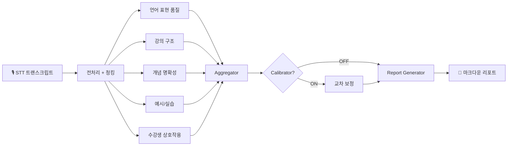

# AI 강의 분석 리포트 — 기획서

> LangGraph 기반 에이전틱 강의 평가 파이프라인 + 대시보드
>
> 멋쟁이사자처럼 AXP 인턴 1-2조 · 2026.03 ~ 2026.04

 

## 프로젝트 개요

| 항목 | 내용 |
| --- | --- |
| **프로젝트명** | AI 강의 분석 리포트 |
| **부제** | LangGraph 기반 에이전틱 강의 평가 파이프라인 + 대시보드 |
| **기간** | 4주 (인턴 프로젝트) |
| **팀 규모** | 4인 인턴팀 (멋쟁이사자처럼) |
| **평가 대상** | 백엔드 부트캠프 21기 (Java, KDT) 강의 15개 |
| **사용 AI 모델** | GPT-4o mini, Claude Opus, Claude Sonnet |
| **주요 기술** | React 19 · LangGraph · FastAPI · GPT-4o · Claude · Supabase |
| **라이선스** | MIT |

 

## 1. 문제 정의

기존 강의 품질 평가 방식(수강생 설문)의 한계는 다음과 같다.

| 문제 | 설명 |
| --- | --- |
| **주관성** | 수강생마다 평가 기준이 다르며, 감정적 요소에 영향을 받음 |
| **비일관성** | 매 강의마다 동일한 기준으로 측정하기 어려움 |
| **행동 불가능성** | "강의가 좋았다/나빴다"는 결론만 있고, 강사가 뭘 바꿔야 하는지 알 수 없음 |
| **비용** | 사람이 직접 강의를 듣고 체크하는 방식은 시간·인력 비용이 큼 |

본 프로젝트는 **강의 녹취록(STT)을 AI가 직접 읽고 18개 항목으로 자동 채점**하여, 일관되고 확장 가능한 강의 품질 평가 시스템을 구축한다.

 

## 2. 성공 지표

| 지표 | 목표 | 달성 여부 |
| --- | --- | --- |
| 평가 일관성 (ICC 평균) | > 0.75 | ✅ **0.877** |
| Cohen's Kappa | > 0.6 | ✅ **0.883** |
| Krippendorff's Alpha | > 0.8 | ✅ **0.873** |
| 점수 안정성 지수 (SSI) | > 0.85 | ✅ **0.974** |
| 대시보드 페이지 수 | 11개 | ✅ **11개** |
| 단위 테스트 커버리지 | - | ✅ **46개** |

 

## 3. 시스템 아키텍처

### 컴포넌트 구성

| 컴포넌트 | 역할 | 비고 |
| --- | --- | --- |
| **STT 트랜스크립트** | 강의 녹음을 텍스트로 변환한 원본 입력 | 외부 STT 도구 사용 |
| **전처리기 (Preprocessor)** | 트랜스크립트를 시간 윈도우 기반으로 청킹 | window=30분, overlap=5분 |
| **카테고리 평가자 ×5** | 각 카테고리를 독립적으로 병렬 평가 | LangGraph Fan-out |
| **Aggregator** | 18개 항목 점수를 가중 평균으로 종합 | LLM 호출 없음, 순수 연산 |
| **Calibrator** | 여러 모델의 점수를 교차 보정 (선택적) | ON/OFF 가능 |
| **Report Generator** | 점수와 근거를 기반으로 자연어 리포트 생성 | GPT-4o 사용 |
| **FastAPI** | 백엔드 REST API 서버 | 평가 실행, OAuth, 설정 |
| **React 19 SPA** | 11개 화면의 분석 대시보드 | Vite + TypeScript |
| **Supabase** | 인증(Auth), DB(PostgreSQL), Edge Functions | Google/Notion OAuth |
| **GitHub Actions** | 파일 업로드 → 자동 평가 → 자동 배포 | CI/CD |

### 청킹 설정

- `window = 30분` (기본값, 15분으로 변경 가능)
- `overlap = 5분` (설명이 청크 경계에 걸리는 문제 방지)
- `first` → 도입부만, `last` → 마무리만, `all` → 전체 청크

 

## 4. 평가 체계

### 4-1. 카테고리 및 항목

| # | 카테고리 | 항목 수 | HIGH 항목 수 | 주요 평가 내용 |
| --- | --- | --- | --- | --- |
| 1 | **언어 표현 품질** | 3 | 1 | 반복 표현 빈도, 발화 완결성, 언어 일관성 |
| 2 | **강의 도입 및 구조** | 5 | 2 | 학습 목표 안내, 복습 연계, 설명 순서, 핵심 강조, 마무리 요약 |
| 3 | **개념 설명 명확성** | 4 | 2 | 개념 정의, 비유/예시 활용, 발화 속도, 선행 개념 확인 |
| 4 | **예시 및 실습 연계** | 2 | 2 | 예시 적절성, 이론→실습 연결 |
| 5 | **수강생 상호작용** | 4 | 3 | 이해 확인 질문, 참여 유도, 질문 응답 충분성, 반응 확인 |
| | **합계** | **18** | **11** | |

### 4-2. 가중치 체계

| 가중치 | 수치 | 의미 | 예시 항목 |
| --- | --- | --- | --- |
| HIGH | 3 | 강의 품질에 핵심적 영향 | 이해 확인 질문, 개념 정의 |
| MEDIUM | 2 | 중요하지만 선택적 | 비유/예시 활용, 복습 연계 |
| LOW | 1 | 보조적 요소 | 마무리 요약, 학습 목표 안내 |

 

## 5. 실험 프레임워크

### 5-1. 신뢰도 메트릭

| 메트릭 | 측정 내용 | 기준값 |
| --- | --- | --- |
| **ICC** (급내상관계수) | 같은 모델로 반복 평가 시 일관성 | > 0.75 Good / > 0.9 Excellent |
| **Cohen's Weighted Kappa** | 두 평가 결과의 일치도 (이견 크기 반영) | > 0.6 Substantial |
| **Krippendorff's Alpha** | 여러 평가자 간 합의 수준 | > 0.8 Reliable |
| **SSI** (점수안정성지수) | 반복 평가 간 점수 변동성 | > 0.85 Stable |

### 5-2. 실험 1 — 평가 일관성 (Test-Retest)

GPT-4o-mini로 15개 강의를 각 3회씩 반복 평가하였다.

| 메트릭 | 결과 | 판정 |
| --- | --- | --- |
| ICC (평균) | **0.877** | ✅ Good |
| Cohen's Kappa | **0.883** | ✅ Almost Perfect |
| Krippendorff's Alpha | **0.873** | ✅ Reliable |
| SSI | **0.974** | ✅ Very Stable |

**결론:** H₀ 기각. GPT-4o-mini는 동일 강의에 대해 높은 수준의 평가 일관성을 보인다. 15개 강의 중 87%가 ICC > 0.75 (Good 이상)이다.

### 5-3. 실험 2 — 청크 크기 민감도

같은 15개 강의를 30분 청크 vs 15분 청크로 평가하고 대응표본 t-test를 수행하였다.

| 통계량 | 결과 | 판정 |
| --- | --- | --- |
| 30분 청크 평균 | 3.245 | — |
| 15분 청크 평균 | 3.033 | — |
| **t(14)** | **4.421** | — |
| **p-value** | **0.0006** | ✅ p < 0.001 |
| **Cohen's d** | **1.142** | 큰 효과 (large) |

**결론:** H₀ 기각. 청크 크기가 점수에 유의미한 영향을 미친다 (p<0.001). 비교 시 반드시 동일 청크 크기를 사용해야 한다.

📄 [상세 분석 보고서 →](experiment_results_midterm.md)

 

## 6. 주요 기능

| # | 기능 | 설명 |
| --- | --- | --- |
| 1 | **18개 항목 자동 평가** | 언어 품질, 강의 구조, 개념 명확성, 예시/실습, 상호작용 5개 카테고리 |
| 2 | **3모델 교차 평가** | GPT-4o mini, Claude Opus, Claude Sonnet 동시 평가 및 비교 |
| 3 | **역할 기반 UI** | 운영자: 전체 KPI + 히트맵 / 강사: 자기 강의 집중 뷰 |
| 4 | **데이터 분석 (EDA)** | 발화량, 화자 구성, 소통 빈도, 습관 표현, 수업 흐름 정량 분석 |
| 5 | **AI 심층 분석** | Claude Opus가 트랜스크립트를 직접 읽고 교수법 특징 정성 분석 |
| 6 | **강의 비교** | 2개 강의를 나란히 놓고 카테고리별 비교 |
| 7 | **점수 추이 추적** | 카테고리별 시계열 변화 시각화 |
| 8 | **항목별 분석** | 18개 항목 중 하나를 선택해 전 강의 점수 + 근거 분석 |
| 9 | **외부 연동** | 구글 드라이브 파일 가져오기, 노션에 결과 내보내기 |
| 10 | **GitHub Actions 자동화** | 파일 업로드 → 자동 평가 → 결과 자동 배포 |
| 11 | **반응형 디자인** | 데스크탑: 사이드바 / 모바일: 하단 탭바 |
| 12 | **실험 프레임워크** | 반복 평가, 모델 비교, 신뢰도 메트릭 자동 계산 |

 

## 7. 대시보드 페이지

| 페이지 | 경로 | 주요 내용 | 주요 사용자 |
| --- | --- | --- | --- |
| **대시보드** | `/dashboard` | 전체 현황, KPI, 히트맵, 추이 차트 | 운영자, 강사 |
| **강의 평가** | `/lectures` | 15개 강의 목록 + 모델 전환 | 운영자, 강사 |
| **데이터 분석** | `/eda` | 발화량, 화자, 소통, 습관, 수업흐름, AI 심층분석 | 운영자 |
| **평가 기준** | `/checklist` | 18개 항목 기준 시각화 | 강사, 운영자 |
| **모델 비교** | `/experiments` | 3모델 점수 비교 + 카테고리 차트 | 운영자 |
| **강의 비교** | `/compare` | 2개 강의를 나란히 비교 | 강사 |
| **점수 추이** | `/trends` | 카테고리별 시계열 변화 | 강사, 운영자 |
| **항목별 분석** | `/items` | 특정 항목의 전 강의 점수 + 근거 | 운영자 |
| **설정** | `/settings` | API 키, 모델, 파라미터, 파일 업로드 | 관리자 |
| **연동 설정** | `/integrations` | 구글 드라이브, 노션 연동 | 관리자 |
| **프로젝트 소개** | `/about` | 아키텍처, 기술스택, 통계 | 전체 |

 

## 8. 기술 스택

| 구분 | 기술 | 버전/비고 |
| --- | --- | --- |
| **프론트엔드** | React | 19 |
| | Vite | 빌드 도구 |
| | TypeScript | 타입 안전성 |
| | Tailwind CSS | v4 |
| | Recharts | 차트 라이브러리 |
| **백엔드** | Python | 3.11 |
| | LangGraph | 에이전틱 파이프라인 |
| | FastAPI | REST API 서버 |
| **LLM** | OpenAI GPT-4o mini | 배치 평가용 |
| | Claude Opus | AI 심층 분석 |
| | Claude Sonnet | 교차 평가 |
| **인증** | Supabase Auth | Google, Notion OAuth |
| **데이터베이스** | Supabase (PostgreSQL) | |
| **서버리스** | Supabase Edge Functions | Deno 런타임 |
| **CI/CD** | GitHub Actions | 평가 자동화 + Pages 배포 |
| **배포** | GitHub Pages | 프론트엔드 |

### API 엔드포인트

| 메서드 | 경로 | 설명 |
| --- | --- | --- |
| `POST` | `/api/evaluate` | 평가 실행 (LangGraph 파이프라인 트리거) |
| `GET` | `/api/experiments` | 이전 실험 목록 조회 |
| `POST` | `/api/settings` | API 키 및 모델 설정 변경 |
| OAuth | `/auth/google`, `/auth/notion` | 구글/노션 OAuth 콜백 처리 |

 

## 9. 데이터

| 항목 | 내용 |
| --- | --- |
| 강의 수 | 15개 (2026.02.02 ~ 02.27) |
| 대상 과정 | 백엔드 부트캠프 21기 (Java, KDT) |
| 평가 모델 수 | 3개 (GPT-4o mini, Claude Opus, Claude Sonnet) |
| 총 평가 결과 수 | 45개 (3모델 × 15강의) |
| EDA 데이터 규모 | 22,756줄 트랜스크립트 |
| 단위 테스트 수 | 46개 |

 

## 10. 고도화 로드맵

### Phase 1. 평가 신뢰성 검증

| # | 과제 | 설명 | 난이도 | 상태 |
| --- | --- | --- | --- | --- |
| 1-1 | **평가 일관성 검정 (Test-Retest)** | 같은 모델로 3번 반복 평가 → ICC, Kappa로 일관성 측정 | ★★ | 완료 |
| 1-2 | **청크 크기 민감도 분석** | 30분 vs 15분 청크 영향 분석 → 대응표본 t-test | ★★ | 완료 |
| 1-3 | **평가 기준 조작적 정의 정교화** | 모호한 표현을 관찰 가능한 행동 지표로 변환 | ★★★ | 진행중 |
| 1-4 | **인간 전문가 대조 검증** | 교수법 전문가 2~3명 평가와 AI 평가 비교 (Pearson r, Bland-Altman) | ★★★ | 예정 |
| 1-5 | **모델 간 교차 신뢰도** | GPT-4o-mini vs Claude Sonnet 일치도 → Krippendorff's Alpha | ★★ | 예정 |
| 1-6 | **Temperature 민감도 분석** | temperature 0.0/0.1/0.3/0.5 변화에 따른 점수 변동 분석 | ★ | 예정 |

#### 1-3. 하네스 정교화 — 모호 표현 분석

| 유형 | 현재 (모호함) | 개선 방향 |
| --- | --- | --- |
| 정도 부사 | "자주", "가끔", "거의" | 구체적 빈도 수치화 (예: "30분당 3회 이상") |
| 주관 형용사 | "적절한", "효과적인", "충분한" | 관찰 가능한 행동 기준으로 대체 |
| 이중 조건 | "빈도가 낮거나 일부 비유가 부적절함" | 조건별 독립 기준 명시 |
| 암묵적 비교 | "이해에 도움이 됨" | 비교 기준 명시 |

#### 1-3. 우선 정교화 대상 항목

| 항목 | 현재 모호 표현 | 개선 방향 |
| --- | --- | --- |
| 3.2 비유 및 예시 활용 | "적절한 비유", "효과적" | 구조적 대응 여부 + 빈도 수치 |
| 5.3 참여 유도 | "적극적으로", "형식적" | 참여 유형 분류 + 빈도 정의 |
| 5.4 질문 응답 충분성 | "충분하게", "상세하고" | 답변 길이 + 개념 확장 여부 |
| 2.3 설명 순서 | "논리적", "자연스러움" | 선수-후속 개념 순서 위반 횟수 |
| 3.3 선행 개념 확인 | "가끔", "자주" | 심화 진입 지점 대비 확인 비율 |

### Phase 2. 외부 벤치마크 비교 (YouTube 강의 대조군)

| # | 과제 | 설명 | 난이도 |
| --- | --- | --- | --- |
| 2-1 | **yt-dlp 자막 수집 파이프라인** | YouTube 자동자막 수집 → VTT → STT 포맷 변환 | ★★ |
| 2-2 | **주제 자동 매칭** | LLM으로 입력 강의 주제 추출 → ytsearch로 유사 강의 탐색 | ★★★ |
| 2-3 | **동일 파이프라인 평가** | YouTube 강의도 동일 18항목 파이프라인으로 평가 | ★★ |
| 2-4 | **비교 리포트 생성** | "이 강사 vs YouTube Top N" 레이더 차트 + 강점/약점 자동 생성 | ★★★ |
| 2-5 | **프론트엔드 벤치마크 페이지** | 레이더 오버레이, 항목별 막대 비교, 인사이트 카드 | ★★ |

### Phase 3. UI/UX 고도화

| # | 과제 | 설명 | 난이도 |
| --- | --- | --- | --- |
| 3-1 | **디자인 시스템 리뉴얼** | 색상, 타이포, 카드, 차트 스타일 전면 개편 | ★★★ |
| 3-2 | **강사용 액션 플랜 뷰** | "다음 강의에서 이것만 바꿔보세요" 형태의 집중 피드백 뷰 | ★★ |
| 3-3 | **시계열 개선 추적** | 강사가 피드백 반영 후 점수 변화를 시각적으로 확인 | ★ |
| 3-4 | **PDF/DOCX 리포트 내보내기** | 대시보드 내용을 문서로 내보내어 관리자 보고용으로 활용 | ★★ |

### Phase 4. 파이프라인 고도화

| # | 과제 | 설명 | 난이도 |
| --- | --- | --- | --- |
| 4-1 | **프롬프트 버저닝** | 하네스 변경 이력 관리 → 프롬프트 수정이 점수에 준 영향 추적 | ★★ |
| 4-2 | **비용 최적화** | 규칙 기반 처리 항목(반복 표현, 발화 속도)을 Python으로 전환 → LLM 호출 50% 절감 | ★★★ |
| 4-3 | **실시간 평가** | 강의 중 실시간 STT → 실시간 피드백 (WebSocket 기반) | ★★★★ |
| 4-4 | **다국어 지원** | 영어 강의 평가 → 글로벌 교육 플랫폼 확장 | ★★ |

 

## 11. 리스크 관리

### 기술 리스크

| 리스크 | 설명 | 대응 방안 |
| --- | --- | --- |
| **LLM 비용** | 15개 강의 × 3회 반복 × 5카테고리 = 225 API 호출 | 비용 추적(`cost_usd`) 내장, 규칙 기반 전환 검토 (Phase 4-2) |
| **응답 일관성** | LLM의 비결정적 특성으로 동일 입력에도 다른 출력 가능 | Temperature=0 고정, 신뢰도 메트릭으로 정량 검증 |
| **청크 크기 의존성** | 청크 크기에 따라 점수가 유의미하게 다름 (실험 2 검증) | 실험 간 반드시 동일 청크 크기 사용 |
| **동기 처리 지연** | FastAPI 현재 동기 방식 → 15개 강의 평가 시 수분 소요 | 비동기 처리 전환 검토, 진행 상태 UI 제공 |

### 품질 리스크

| 리스크 | 설명 | 대응 방안 |
| --- | --- | --- |
| **모호한 평가 기준** | 하네스의 주관적 표현이 모델 해석 차이 유발 | Phase 1-3 조작적 정의 정교화 |
| **인간 검증 미비** | AI 평가 결과를 전문가 검증 없이 사용하는 위험 | Phase 1-4 교수법 전문가 대조 검증 |
| **도메인 편향** | 백엔드 Java 강의에만 최적화된 평가 기준 | 다양한 도메인 강의로 검증 확장 필요 |

### 운영 리스크

| 리스크 | 설명 | 대응 방안 |
| --- | --- | --- |
| **API 키 보안** | OPENAI_API_KEY 등 민감 정보 노출 위험 | GitHub Secrets 사용, `.env` 파일 `.gitignore` 처리 |
| **YouTube 자막 수집 제약** | yt-dlp를 통한 자동자막 수집 시 저작권/정책 문제 가능 | 공개 강의에 한정, 이용약관 검토 필요 |
| **Supabase 의존성** | Auth, DB, Edge Functions 모두 Supabase에 의존 | 주요 데이터 백업, 대안 인프라 검토 |

 

## 12. 배포

| 컴포넌트 | 호스팅 | 배포 방식 |
| --- | --- | --- |
| **프론트엔드 (React SPA)** | GitHub Pages | `main` 브랜치 push → GitHub Actions 자동 빌드/배포 |
| **백엔드 (FastAPI)** | (별도 서버 필요) | 로컬 또는 클라우드 서버 |
| **데이터베이스** | Supabase (PostgreSQL) | 관리형 서비스 |
| **인증** | Supabase Auth | Google/Notion OAuth |
| **서버리스 함수** | Supabase Edge Functions | Deno 런타임 |

 

## 13. 참고 문서

| 문서 | 경로 |
| --- | --- |
| 상세 실험 분석 보고서 | `docs/experiment_results_midterm.md` |
| 평가 하네스 (카테고리별) | `src/harnesses/category_*.md` |
| 실험 결과 저장소 | `experiments/{id}/results/` |
| 인터페이스 계약서 | `docs/interface_contract.md` |

 

## 14. 팀 구성

[README.md → 팀 섹션](../README.md#-팀) 참조.
